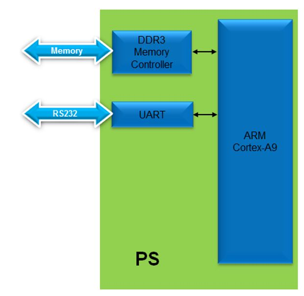
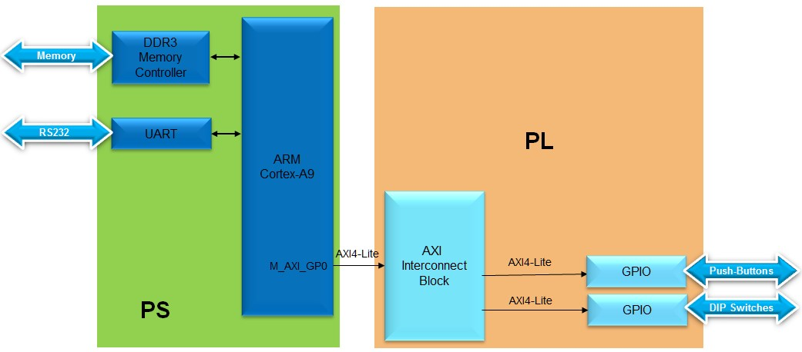
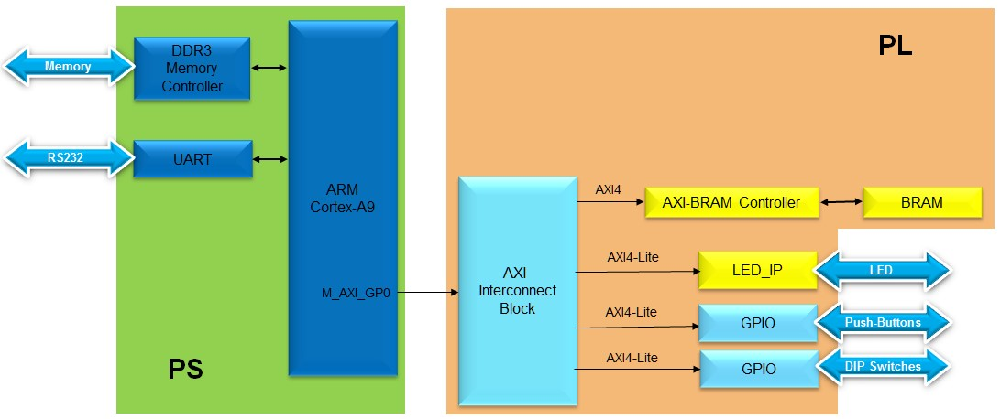
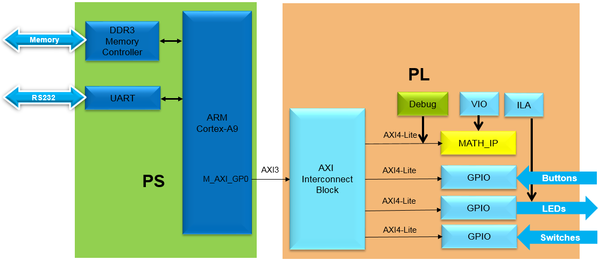
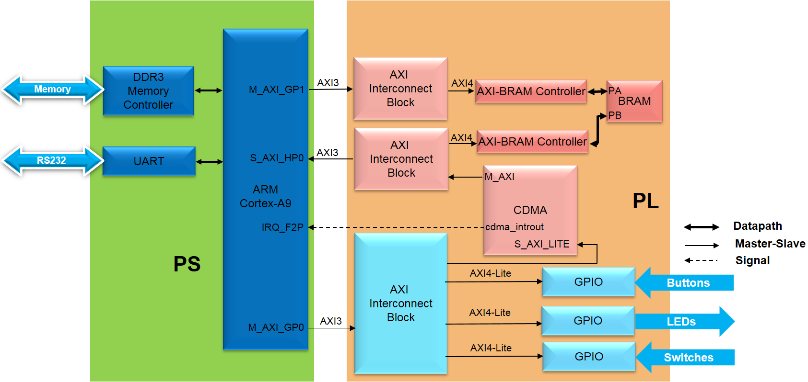
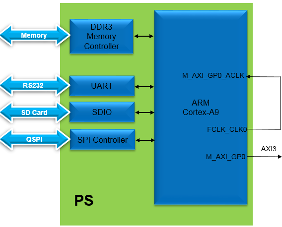

# Luồng thiết kế hệ thống nhúng trên Zynq

## Tóm lược các bài thực hành

Mục đích của tài liệu này là hướng dẫn các bạn thiết kế một hệ thống hoàn chỉnh từ phần cứng đến phần mềm. Nó cung cấp cho người học những kỹ năng cần thiết để phát triển các hệ thống nhúng phức tạp và cho phép họ cải thiện thiết kế bằng cách sử dụng các công cụ có sẵn trong Vivado và Vitis IDE. Nó cũng giúp các nhà phát triển hiểu và sử dụng các phần nâng cao của thiết kế hệ thống nhúng để kiến trúc một hệ thống phức tạp trong hệ thống trên một chip Zynq™.

## Cài đặt các tập tin mã nguồn

Để sử dụng các mã nguồn cho mỗi bài thực hành trong khóa học này, các bạn phải tải về hoặc nhân bản kho lưu trữ này từ GitHub.

Trên trang GitHub chính cho một kho lưu trữ (repository), các bạn có thể lựa chọn **Clone or download** và chọn **Download Zip** để tải về tập tin nén của kho lưu trữ đó. Sau đó, các bạn có thể giải nén tập tin này thành một thư mục trên máy tính của bạn.

Nếu bạn muốn sử dụng **git** bạn có thể sao chép kho lưu chữ này bằng lệnh:

```
  git clone https://github.com/Xilinx/xup_embedded_system_design_flow
```
Trong hướng dẫn cho các bài thực hành;

**{sources}** chỉ thư mục ./sources trong kho lưu chữ này sau khi các bạn đã sao chép hoặc nhân bản kho lưu trữ này vào một thư mục nội bộ.

**{labs}** chỉ vị trí được dùng như là khu vực làm việc (workspace) cho mỗi bài thực hành trong khóa học này.

**{Vitis_Workspace}** chỉ thư mục làm việc để chạy Vitis IDE.

---
**Chú ý**

Cấu hình cho bo mạch PYNQ-Z2 mặc định chưa được tích hợp vào Vivado. Các tập tin liên quan cần được giải nén và lưu vào thư mục: {Vivado installation}\data\boards\board_files\

Nếu chưa có thư mục board_files, hãy tạo nó bằng tay.

Các tập tin này có thể được tải về tại đây:

PYNQ-Z2:[/board_files](/board_files/).

---

## Cấu hình phần cứng

**PYNQ-Z2**: Kết nối cáp micro USB từ bo mạch vào máy tính. Hãy chắc chắn là chân nối (jumper) được kết nối vào JTAG (giữa chân JP1_1 và JP1_2) và một chân khác trong số chúng nên được kết nối qua các chân USB (giữa chân J9_2 và J9_3).


## Đọc thêm:
   Cuốn sách Zynq có thể được dùng để tìm hiểu thêm thông tin về công nghệ Zynq được sử dụng trong các bài thực hành này. Cuốn sách có thể được tải miễn phí tại http://www.zynqbook.com/.
   
## Tổng quan các bài thực hành:

### Bài thực hành 1

Trong bài thực hành này, các bạn sẽ sử dụng bộ tích hợp IP (IP Integrator) để tạo ra một thiết kế dựa trên hệ thống tính toán bao gồm các thành phần sau:
  *	Lõi ARM Cortex A9 (PS)
  *	UART để truyền thông nối tiếp
  *	Bộ điều khiển DDR3 dùng cho bộ nhớ DDR3_SDRAM bên ngoài 

    <p align="center">
    
    </p>
    <p align = "center">
    <i>Thiết kế của hệ vi xử lý trong bài thực hành này</i>
    </p>

### Bài thực hành 2
   Bài thực hành này hướng dẫn các bạn quy trình mở rộng hệ thống tính toán đã được xây dựng trong bài thực hành trước bằng cách thêm hai lõi IP GPIO (General Purpose Input/Output)
   
   <p align="center">
   
   </p>
   <p align = "center">
   <i>Mở rộng Hệ thống trong bài thực hành 1</i>
   </p>

### Bài thực hành 3

  Bài thực hành này hướng dẫn các bạn quy trình tạo và thêm một thiết bị ngoại vi tùy biến vào một hệ thống vi xử lý bằng cách sử dụng công cụ Vivado IP Packager. Các bạn sẽ tạo một thiết bị ngoại vi dùng giao diện AXI4Lite.

  Các bạn sẽ mở rộng thiết kế phần cứng trong bài thực hành số 2 bằng cách tạo mới và thêm một thiết bị ngoại vi dùng giao tiếp AXI vào hệ thống, và kết nối nó đến các đèn LED trên bo mạch Zynq đang được sử dụng. Các bạn sẽ sử dụng bộ đóng gói IP (IP Packager) để sinh ra một IP tùy biến. Sau đó, các bạn sẽ kết nối thiết bị ngoại vi này vào hệ thống và thêm các ràng buộc về vị trí chân (pin location) để kết nối thiết bị ngoại vi điều khiển màn hình LED đến màn hình LED trên bo mạch. Cuối cùng, các bạn sẽ thêm bộ điều khiển BRAM và BRAM trước khi tạo ra bitstream.

  <p align="center">
  
  </p>
  <p align = "center">
  <i>Thiết kế được cập nhật từ các bài thực hành trước đó</i>
  </p>

### Bài thực hành 4

  Bài thực hành này hướng dẫn các bạn quy trình viết một ứng dụng phần mềm cơ bản. Phần mềm mà các bạn phát triển sẽ viết vào các đèn LED trên bo mạch Zynq. Bộ điều khiển AXI BRAM và bộ nhớ BRAM 8KB đi kèm đã được thêm vào trong bài thực hành trước đó. Ứng dụng sẽ chạy từ bộ nhớ BRAM bằng cách thay đổi các kịch bản liên kết (linker script) dành cho dự án này để đặt vùng nhớ mã lệnh (text section) của ứng dụng vào trong bộ nhớ BRAM. Các bạn sẽ kiểm chứng thiết kế hoạt động như mong muốn bằng cách kiểm tra trên phần cứng. 

  Thiết kế được mở rộng ở phần cuối của bài thực hành trước đó để thêm bộ điều khiển bộ nhớ, và bitstream đến thời điểm này đã sẵn sàng. Một ứng dụng phần mềm đơn giản sẽ được phát triển để truy cập các LED trên bo mạch Zynq.

### Lab 5

   Bài thực hành này hướng dẫn các bạn quy trình viết một ứng dụng phần mềm sử dụng bộ định thời (timer) của CPU. Các bạn sẽ tham chiếu các API của bộ định thời trong công vụ Vitis IDE để tạo mới và gỡ rối các ứng dụng phần mềm. Các ứng dụng mà các bạn phát triển sẽ theo dõi các giá trị của công tắc trượt (dip switch) và tăng một giá trị đếm hiển thị qua đèn LED. Ứng dụng sẽ kết thúc khi nút bấm (push button) trung tâm được nhất. 
   

   Các bạn sẽ sử dụng thiết kế phần cứng được tạo ra trong bài thực hành số 4 để sử dụng bộ định thời riêng của CPU (xem trong Hình). Các bạn sẽ phát triển mã nguồn để sử dụng nó.

   <p align="center">
   
   </p>
   <p align = "center">
   <i>Thiết kế hoàn chỉnh</i>
   </p>

### Bài thực hành 6

  Phần mềm và phần cứng tương tác với nhau trong các hệ thống nhúng. Vitis bao gồm bộ gỡ rối hệ thống (System Debugger) được dùng như một công cũ gỡ rối phần mềm. Công cụ phân tích phần cứng (hardware analyzer) có các loại lõi thiết kế khác nhau cho phép gỡ rối phần cứng bằng cách cho phép truy cập các tín hiện nội bộ mà không cần phải kết nối ra các chân của chip. Các lõi gỡ rối phần cứng (hardware debug cores) này nằm ở trong phần lô-gíc có thể lập trình được (PL) của thiết bị và có thể được cấu hình với nhiều chế độ có thể theo dõi tín hiệu ở trong thiết kế. Trong bài thực hành này, các bạn sẽ được giới thiệu về các lõi gỡ rối khác nhau.

  <p align="center">
  
  </p>
  <p align = "center">
  </p>


### Bài thực hành 7
  Trong hệ thống Zynq, nhiều kết nối sẵn sàng giữa phần hệ thống xử lý (PS) và phần lô-gíc lập trình được (PL) với các mức độ hiệu năng truyền dữ liệu khác nhau giữa hai hệ thống con. Kết nối bus AXI Chủ (Master) và Tớ (Slave) đa dụng (GP) dùng trong các bài thực hành trước đó được dùng cho các thiết bị ngoại vi không yêu cầu băng thông cao ví dụ các công tắc, các đèn led, bàn phím, chuột. Có 4 giao diện AXI hiệu năng cao từ bus tớ PS sang bus chủ PL dùng cho các thiết bị ngoại vi cần băng thông cao hơn ví dụ các ứng dụng xử lý hình ảnh và Video. Bài thực hành này sẽ hướng dẫn các bạn quy trình kích hoạt một cổng bus tớ AXI hiệu năng cao trong phần PS, thêm vào một bộ điều khiển truy cập bộ nhớ trực tiếp trung tâm (CDMA), và thực hiện Truy cập bộ nhớ trực tiếp (DMA) giữa các bộ nhớ.
  
  <p align="center">
  
  </p>
  <p align = "center">
  </p>

### Lab 8
  Bài thực hành này hướng dẫn các bạn các bước tạo mới một hệ thống có khả năng khởi động từ thẻ nhớ SD hoặc từ bộ nhớ QSPI Flash trên bo mạch. Bài thực hành này cũng thể hiện các bitstream khác nhau có thể được nạp lên phần PL sau khi bo mạch được khởi động lên và các ứng dụng tương ứng có thể được thực thi.

  <p align="center">
  
  </p>
  <p align = "center">

### Credit
Nội dung này được dịch bởi nhóm nghiên cứu Hệ thống tích hợp thông minh, [Viện Công nghệ thông tin, Đại học Quốc gia Hà Nội](https://iti.vnu.edu.vn).

  ------------------------------------------------------
<p align="center">Bản quyền&copy; 2022, Tập đoàn Advanced Micro Devices.</p>
