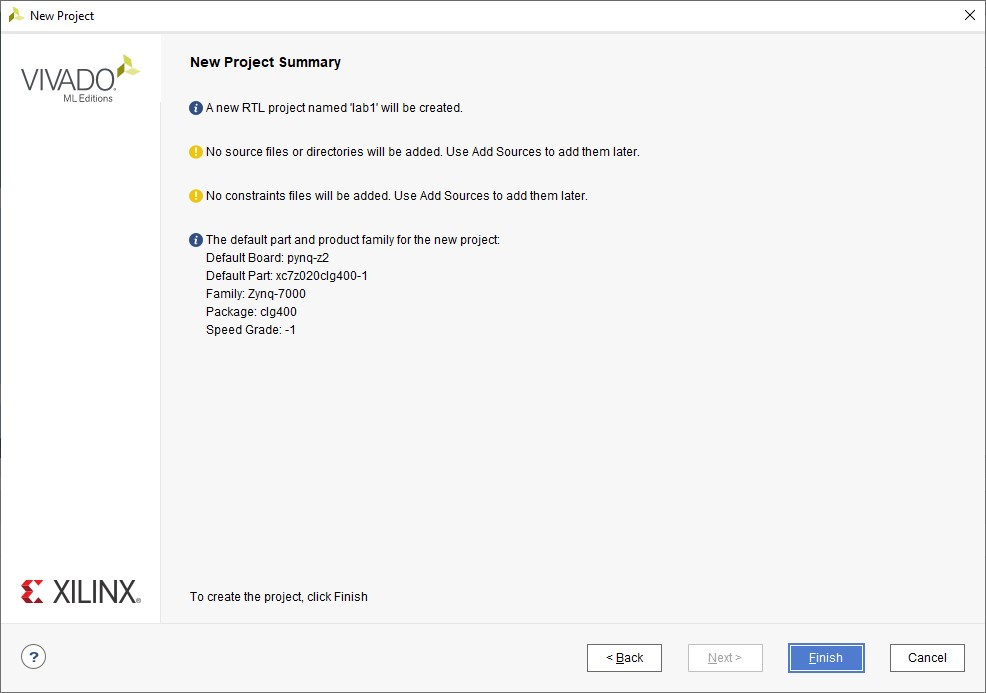
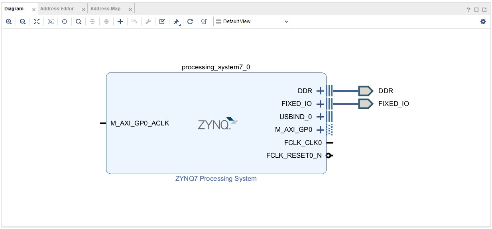

# Xây dựng một Hệ thống nhúng hoàn chỉnh

## Mục tiêu

Sau khi hoàn thành Lab này, bạn sẽ có thể:

* Tạo một thiết kế hệ thống nhúng sử dụng Vivado và SDK flow
* Định cấu hình cho Processing System (PS)
* Thêm IP theo tiêu chuẩn của Xilinx trong Programmable Logic (PL)
* Sử dụng SDK để xây dựng một dự án phần mềm và kiểm thử chức năng của thiết kế trong phần cứng 
## Các bước

## Tạo một dự án trong Vivado

### Khởi chạy Vivado và tạo một dự án trống với vi mạch đích là PYNQ-Z1 hoặc PYNQ-Z2, chọn ngôn ngữ đích là Verilog

1. Mở Vivado bằng cách chọn **Start > All Programs > Xilinx Design Tools > Vivado 2021.2**
1. Chọn **Create Project** để bắt đầu chương trình. Bạn sẽ nhìn thấy hiện lên trang _Create A New Vivado Project_ . Chọn **Next**.
1. Chọn Browse button của trường _Project Location_ trong **New Project** , duyệt đến **{labs}** , và chọn **Select**.
1. Nhập **lab1** trong trường _Project Name_.  Hãy chắc chắn rằng mục _Create Project Subdirectory_ được tick.  Chọn **Next**.
1. Chọn **RTL Project** trong _Project Type_ form, và đánh dấu vào ô **Do not specify sources at this time**. Bấm chọn **Next**.
1.	Trong cửa sổ _Default Part_, chọn **Boards**, và phụ thuộc vào bo mạch mà bạn đang sử dụng, (Nếu không thể tìm thấy bo mạch, làm theo hướng dẫn tại   để cấu hình) và bấm chọn **Next**.

    

    
    

    

    <i>Lựa chọn Bo mạch và parts</i>
    

1. Kiểm tra phần thông tin tổng hợp dự án (**Poject Summary**) (tương tự như trong hình dưới đây) và chọn **Finish** để tạo một dự án Vivado trống.
    

    
    

    

    <i>Thông tin tổng hợp dự án</i>
    

### Tạo hệ thống sử dụng bộ tích hợp IP (**IP Integrator)

1. Tạo một khối thiết kế trong dự án Vivado sử dụng IP Integrator để tạo ra một hệ thống phần cứng dựa trên bộ xử lý ARM Cortext-A9
1. Trong _Flow Navigator_, ấn chọn **Create Block Design** trong **IP Integrator**.
    

    
    

    

    <i>Tạo khối thiết kế với IP Integrator</i>
    

1. Đặt tên cho hệ thống và ấn chọn **OK**.

1. Chuột phải vào bất cứ chỗ nào trong cửa sổ **Diagram** và chọn **Add IP**.
    

    
    

    

    <i>Thêm IP vào khối thiết kế</i>
    
        

1. Khi **IP Catalog** được mở, gõ "zynq" vào thanh tìm kiếm, tìm và bấm đúp chuột vào mục **ZYNQ7 Processing System**, hoặc bấm vào mục và ấn nút **Enter** để thêm IP vào thiết kế.

1. Chú ý thông báo màu xanh ở phía trên cùng của cửa sổ **Diagram** để được hỗ trợ thiết kế. Chọn **Run Block Automation**.

1. Cửa sổ mới hiện lên được gọi là cửa sổ **Run Block Automation**. Trong đấy, chọn **processing_system7_0**, giữ nguyên cấu hình cơ bản và bấm chọn **OK**.

1. Khi **Block Automation** hoàn thành, một khối thiết kế của vi xử lý Zynq sẽ xuất hiện với các chân **DDR** (Double Data Rate, một dạng bộ nhớ), **Fixed IO**, và một số các chân khác được nối tự động. Cấu hình nhúng cho vi xử lý Zynq tương thích với bo mạch được áp dụng và có thể thay đổi ngay sau đây. Khối thiết kế nên nhìn giống như sau:

	

    
    

    

     <i> Khối Zynq với các chân DDR và Fixed IO</i>
    

	
1. Bấm đúp chuột vào khối Zynq để mở cửa số **Customization**.
   Chú ý rằng cửa sổ **Customization** sẽ hiển thị các khối ngoại vi được chọn (peripherals) (với các dấu tích). Đây là cấu hình cơ bản cho bo mạch được sinh ra bởi **Block Automation**.

#### Cấu hình khối vi xử lý chỉ với cổng ngoại vi UART 1.

1. Khối thiết kế của Zynq sẽ được mở lại, hiển thị nhiều khối có thể cấu hình của hệ thống xử lý (**Processing System**).

1. Tại bước này, người thiết kế có thể chọn nhiều loại khối có thể cấu hình (in đậm màu xanh) and thay đổi cấu hình hệ thống.

1. Chọn một trong các ngoại vi (màu xanh) trong khối **Peripheral I/O Pins** của khối thiết kế Zynq, hoặc chọn mục **MIO Configuration** ở bên trái để mở dạng cấu hình.

1. Tăng số lượng chân **Peripheral I/O Pins** nếu cần thiết, và đảm bảo tất cả các cổng ngoại vi sau không được chọn, trừ **UART 1**.
   
   >**Chú ý :** Chọn **UART 0** cho PYNQ-Z2 thay vì **UART 1**.
   
    i.e. Bỏ chọn: &nbsp; <i>ENET

    &nbsp; &nbsp; &nbsp; &nbsp; &nbsp; &nbsp; &nbsp; &nbsp; &nbsp; &nbsp; &nbsp; USB 0

    &nbsp; &nbsp; &nbsp; &nbsp; &nbsp; &nbsp; &nbsp; &nbsp; &nbsp; &nbsp; &nbsp; SD 0

    &nbsp; &nbsp; &nbsp; &nbsp; &nbsp; &nbsp; &nbsp; &nbsp; &nbsp; &nbsp; &nbsp; Bấm vào **GPIO** để bỏ chọn GPIO MIO

    &nbsp; &nbsp; &nbsp; &nbsp; &nbsp; &nbsp; &nbsp; &nbsp; &nbsp; &nbsp; &nbsp; Bấm vào **Memory Interfaces** để bỏ chọn Quad SPI Flash

    &nbsp; &nbsp; &nbsp; &nbsp; &nbsp; &nbsp; &nbsp; &nbsp; &nbsp; &nbsp; &nbsp; Bấm vào **Application Processor Unit** để bỏ chọn Timer 0.
    </i>

    

    
    

    

    <i> Chỉ chọn UART 1</i>
    
  

1. Chọn mục **PS-PL Configuration** ở phía bên trái.

1. Bấm vào **AXI Non Secure Enablement > GP Master AXI Interface** và bỏ chọn MAXI GP0 Interface.

1. Mở rộng **General > Enable Clock Resets** và bỏ chọn mục FCLK_RESETN0_N.

1. Chọn mục **Clock Configuration** ở bên trái. Mở rộng **PL Fabric Clocks** và bỏ chọn FCLK_CLK0 và chọn **OK**.

1. Bấm vào nút **Regenerate Layout** (mũi tên màu xanh) hiển thị dưới đây:
    

    
    

    

    <i> Tái khởi tạo và kiểm thử thiết kế</i>
    
  

1. Bấm vào nút **Validate Design** (mũi tên màu tím) và đảm bảo rằng không có lỗi.

### Tạo **Top-Level** và trích xuất phần cứng

1. Trong mục **sources**, chuột phải vào **system.bd**, và chọn **Generate Output Products...** và bấm **Generate** để sinh ra các tệp thực thi, mô phỏng và tổng hợp (Implementation, Simulation, Synthesis) cho thiết kế (Bạn có thể bấm chọn **Generate Block Design** trong thanh **Flow Navigator** để làm việc tương tự).
    

    
    

    

    <i> Tạo sản phẩm sau thiết kế </i>
    
  

1. Chuột phải một lần nữa vào **system.bd**, và chọn **Create HDL Wrapper...** để tạo ra khối **Top-Level** dưới dạng VHDL. Chọn **Let Vivado manager wrapper** và **auto-update**, và bấm **OK**.

	Tệp tin **system_wrapper.v** sẽ được tạo và thêm vào dự án. Nhấp đúp chuột vào têp tin để xem nội dung trong thanh **Auxiliary**.
    

    
    

    

    <i> Tệp tin **HDL Wrapper** được tạo và thêm vào dự án</i>
    
  

1. Chú ý rằng têp tin Verilog đã được đặt là khối thiết kế chính (top module), biểu thị bởi biểu tượng.
1. Chọn **File > Export > Export Hardware** và bấm **OK**. (Lưu dự án nếu cần thiết)
Chú ý: Bởi vì không có bất kỳ phần cứng nào trong phần lập trình lô-gíc (**Programmable Logic** (PL)) nên sẽ không có **bitstream** nào được sinh ra. Do đó, lự chọn **Include Bitstream** không cần thiết vào lúc này.

1. Thông tin cơ bản về cấu hình phần cứng của dự án có thể được tìm thấy trong tệp Xilinx Support Archive (XSA), cùng với thông tin địa chỉ bộ nhớ cho hệ thống PS, và thông tin driver. Tệp .xsa được dùng trong môi trường phần mềm sẽ quyết định thiết bị ngoại vi có thể sử dụng trong hệ thống, và địa chỉ bộ nhớ của chúng.

### Tạo ứng dụng kiểm tra bộ nhớ trong Vitis IDE

1. Chọn **Tools > Launch Vitis IDE**, và chọn vùng làm việc tùy ý. Bấm **Launch**. **Vitis IDE** sẽ khởi chạy.

1. Kiểm tra phần giới thiệu và đóng khi xong. Bấm vào phần **Create Application Project**, và chọn **Next**.

1. Trong cửa sổ **Platform Selection**, chọn **Create a new platform from hardware (XSA)** và tìm chọn tệp **system_wrapper.xsa** đã được sinh ra từ trước đó. (Mặc định tệp ở trong thư mục {labs}\lab1).

1. Điền **lab1_platform** là tên của nền tảng (_Platform name_), và chọn **Next**.
    

    
    

    

    <i> Chọn nền tảng để tạo dự án </i>
    
 

1. Trong cửa sổ thông tin chi tiết dự án, đặt tên dự án là **lab1**, và trong phần **Target Processor**, chọn **ps7_cortexa9_0**.

1. Chọn **Memory Tests** là bản mẫu trong cửa sổ **Template Selection**. Chọn **Finish**
    

    
    

    

    <i> Chọn một bản mẫu để tạo dự án </i>
    
 

1. Mở rộng các thư mục trong phần **Explorer** bên trái, và bạn sẽ thấy có hai dự án - lab1_platform, và lab1_system. Dự án **lab1_system** là ứng dụng sẽ được dùng để kiểm chứng tính đúng đắn của thiết kế. **lab1_platform** là dự án nền tảng bao gồm hàm chức năng **ps7_init**, được dùng để khởi tạo PS như một phần của bước đầu trong **bootloader**. **Explorer** nên trông giống như sau:
    

    
    

    

    <i> Hình ảnh về Project Explorer </i>
    
  

1. Mở tệp tin **memorytests.c** trong phần **lab1_system > lab1 > src**, và kiểm tra nội dung. Tệp này sẽ gọi các chức năng để kiểm tra bộ nhớ.

1. Có thể biên dịch dự án ứng dụng này bằng cách bấm vào nút hình búa hoặc chuột phải trong dự án ứng dụng và chọn **Build Project** như trong hình dưới đây. Khi dự án được biên dịch xong, bạn có thể thấy được thông tin trong cửa sổ **Console**.
    

    
    

    

    <i> Biên dịch dự án ứng dụng </i>
    
  

### Kiểm tra trong phần cứng

1. Đảm bảo rằng dây micro-USB được kết nốt vào bo mạch và máy tính PC. Chuyển chế độ boot sang JTAG. Cấp nguồn cho bo mạch.

1. Mở tiện ích truyền thông nối tiếp cho cổng COM tương ứng với hệ thống của bạn. Nền tảng phần mềm Vitis cung cấp cửa sổ tiện ích **terminal** nối tiếp. Tính năng này sẽ được dùng trong suốt quá trình hướng dẫn. Bạn có thể chọn ứng dụng khác có tính năng tương tự nếu bạn muốn.
   * Để mở tiện ích này, chọn **Window > Show view**.
   * Trong mục **Show View**, điền **terminal** trong thanh tìm kiếm.
   * Chọn **Vitis Serial Terminal** và bấm **Open**.
    

    
    

    

    <i> Mở cửa sổ Vitis Serial Terminal </i>
    

   
1. Bấm vào nút **Add** trong cửa sổ **Vitis Serial Terminal** để tạo một terminal mới. Chọn cổng phù hợp. Giữ các cấu hình nâng cao. Chọn **OK**.
	

    
    

    

    <i> Kết nối cổng nối tiếp </i>
    

1. Chuột phải **lab1_system > lab1** và chọn **Launch Hardware (Single Application Debug)**.
    

    
    

    

    <i> Khởi chạy Run Configuration </i>
    

1. Bạn sẽ thấy các thông tin sau trong thanh Terminal.
    

    
    

    

    <i> Kết nối cổng nối tiếp </i>
    

1. Đóng Vivado và Vitis IDE bằng cách chọn **File > Exit** trong từng chương trình.

### Kết luận

Vivado và IP Integrator cho phép các hệ thống vi xử lý cơ bản và ứng dụng được tạo ra một cách nhanh chóng. Sau khi hệ thống được cấu hình, phần cứng có thể được trích xuất và Vitis IDE sẽ được mở từ Vivado.

Phát triển phần mềm sẽ được thực hiện trong Vitis IDE. Vitis cung cấp một số ứng dụng mẫu bao gồm cả kiểm tra bộ nhớ. Bạn có thể kiểm tra hoạt động của phần cứng bằng cách dùng ứng dụng kiểm thử, thực thi trên vi xử lý, và quan sát kết quả đầu ra trong của sổ terminal.
