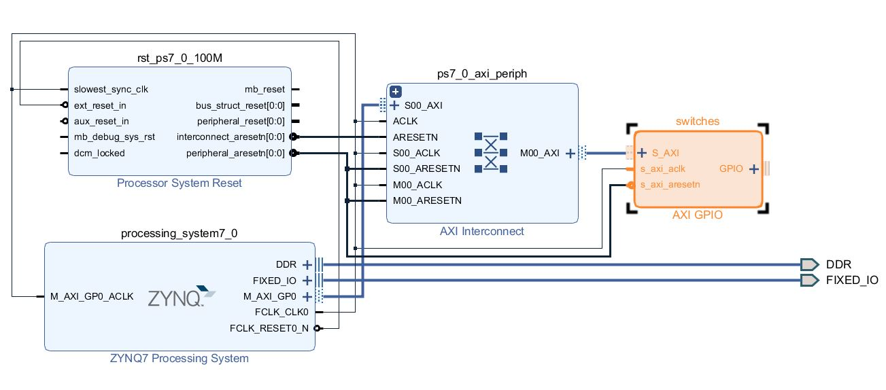
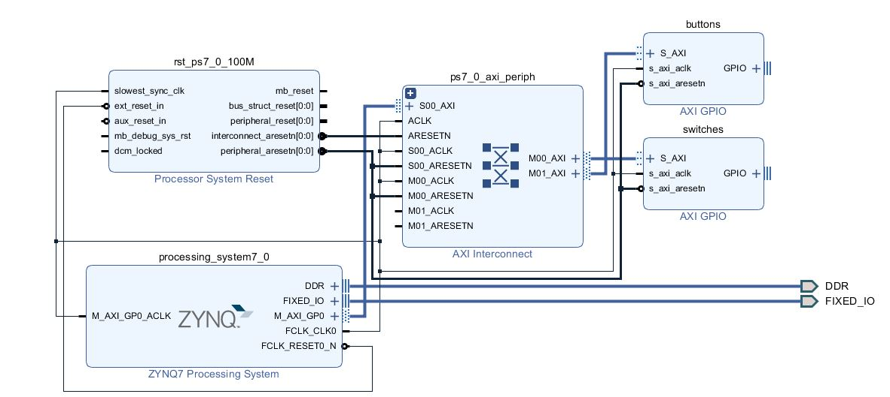
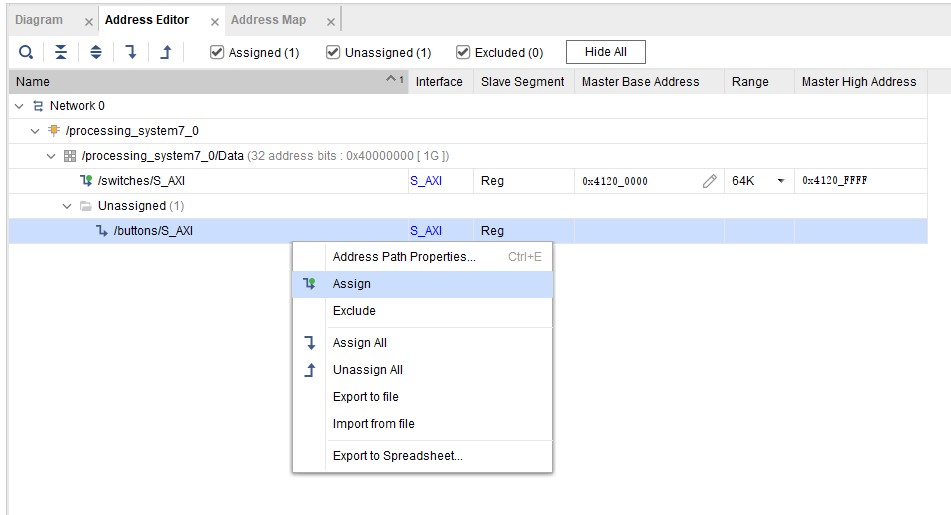
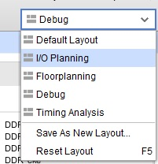
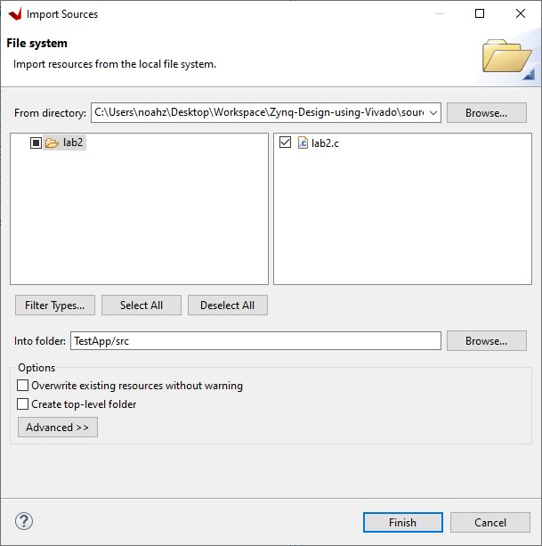
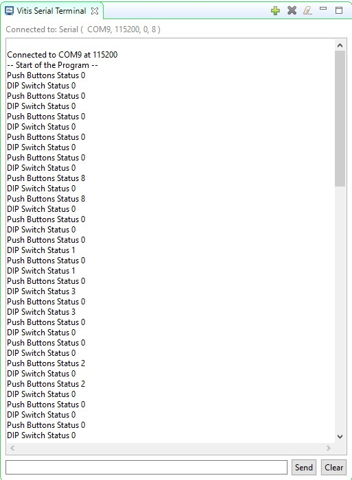

# Thêm các lõi IP vào PL

## Mục tiêu:

Sau khi hoàn thành bài thực hành này, bạn sẽ có khả năng:
*   Cấu hình cổng GP Master của PS để kết nối với IP trong PL.
*   Thêm IP bổ sung vào thiết kế phần cứng.
*   Thiết lập một số cài đặt trình biên dịch.

## Các bước thực hiện

### Mở dự án

1. Mở dự án trước đó.
2. Chọn **File > Project > Save As...** để mở dự án đã lưu dưới dạng hộp thoại. Nhập lab2 làm tên dự án. Đảm bảo rằng tùy chọn Tạo Thư mục Dự án Con đã được chọn, đường dẫn thư mục dự án là **{labs}** và nhấp OK. Điều này sẽ tạo ra thư mục lab2 và lưu dự án và thư mục liên quan với tên lab2.

### Thêm hai thực thể GPIO

1. Trong bảng điều khiển Nguồn, mở rộng system_wrapper và nhấp đúp vào tệp system.bd (system_i) để mở bộ tích hợp IP.
2. Nhấp đúp vào khối Zynq trong sơ đồ để mở cửa sổ cấu hình Zynq.
3. Chọn mục **PS-PL Configuration** ở phía trái.
4. Mở rộng **AXI Non Secure Enablement** > **GP Master AXI Interfaces**, nếu cần, và nhấp vào ô Enable **M_AXI_GP0 interface** ở phía dưới để bật cổng AXI GP0.
5. Mở rộng **General > Enable Clock Resets** và chọn tùy chọn FCLK_RESET0_N.
6. Chọn tab **Clock Configuration** ở phía trái. Mở rộng **PL Fabric Clocks** và chọn tùy chọn FCLK_CLK0 (với tần số clock yêu cầu là 100.000000 MHz) và nhấp OK.
7. Chú ý rằng sự bổ sung giao diện *M_AXI_GPO*,và các cổng *M_AXI_GPO_ACLK*, *FCLK_CLK0*, và *FCLK_RESET0_N* bây giờ được ở trong khối Zynq. Bạn có thể nhấp vào nút regenerate để vẽ lại sơ đồ để có cái gì đó giống như sau:

<i>Hệ thống Zynq với giao diện AXI và clock</i>

8. Tiếp theo, thêm một IP bằng cách **nhấp phải vào cửa sổ Sơ đồ (Diagram window) > Add IP** và tìm kiếm AXI GPIO trong danh mục.

9. Nhấp đúp vào AXI GPIO để thêm lõi vào thiết kế. Lõi này sẽ được thêm vào thiết kế và sơ đồ khối sẽ được cập nhật.

10. Nhấp vào khối AXI GPIO để chọn nó, và trong tab thuộc tính (Properties), đổi tên thành **switches**.

   

   
   

   

   <i>Đổi tên mặc định AXI GPIO</i>
   

11. Nhấp đúp vào khối AXI GPIO để mở cửa sổ tùy chỉnh.
12. Chọn thẻ Board, từ **Board Interface** kéo xuống, chọn **sws 2bits** cho giao diện **GPIO** IP. Để lại GPIO ở cài đặt mặc định.
13. Tiếp theo, nhấp vào tab IP Configuration và lưu ý rằng độ rộng đã được đặt để phù hợp với các công tắc trên PYNQ-Z2 (2)

  Chú ý rằng thiết bị ngoại vi có thể được cấu hình cho hai kênh, nhưng vì chúng ta chỉ muốn sử dụng một kênh mà không có ngắt, hãy để **Enable Dual Channel** và **Enable Interrupt** ở trạng thái không được chọn.
      > Ở đây, "channels" chỉ đơn giản là đường kết nối dây giữa các thiết bị ngoại vi và các thành phần khác. Dual Channel sẽ cho phép bạn truyền tín hiệu có độ dài 128 bit, trong khi việc sử dụng chỉ một kênh chỉ cho phép tín hiệu có độ dài 64 bit. Tùy chọn này là để tăng băng thông của kết nối mà thiết bị ngoại vi này có thể gửi.

14. Nhấp vào OK để lưu và đóng cửa sổ tùy chỉnh.
15. Chú ý rằng **Designer assistance** đang sẵn có. Nhấp vào Run Connection Automation và chọn **/switches/S_AXI.**
16. Nhấp OK khi được yêu cầu để tự động kết nối giao diện master và slave. Chú ý rằng hai khối bổ sung, Processor System Reset và AXI Interconnect, đã tự động được thêm vào thiết kế. (Các khối có thể được kéo để sắp xếp lại hoặc thiết kế có thể được vẽ lại).

	

	
	

	

	<i>Thiết kế với các công tắc được kết nối tự động.</i>
	

17. Thêm một trường hợp khác của thiết bị ngoại vi GPIO (Add IP). Đặt tên cho nó là buttons.
18. Nhấp đúp vào khối IP, trong giao diện GPIO chọn btns 4bits cho PYNQ-Z2, nhấp OK.

Ở bước này, có thể chạy tự động kết nối, hoặc khối có thể được kết nối thủ công. Lần này, khối sẽ được kết nối thủ công.

19. Nhấp đúp vào AXI Interconnect (tên: ps7_0_axi_periph) và thay đổi Số lượng **Master Interfaces** thành 2, sau đó nhấp OK.
    

    
    

    

    <i>Thêm cổng master vào AXI Interconnect.</i>
	

20. Nhấp vào cổng **s_axi** của khối AXI GPIO (tên: buttons), và kéo con trỏ về phía khối AXI Interconnect.

	Thông báo "Found 1 interface" sẽ xuất hiện, và một dấu tích xanh sẽ xuất hiện bên cạnh cổng M01_AXI trên AXI Interconnect, chỉ ra rằng đây là một cổng hợp lệ để kết nối. Kéo con trỏ đến cổng này và nhả nút chuột để thực hiện kết nối.
21. Tương tự, kết nối các cổng sau:
	*buttons s_axi_aclk -> Zynq7 Processing System FCLK_CLK0*
	> Điều này đảm bảo rằng hệ thống xử lý Zynq và các thiết bị ngoại vi giao tiếp đồng bộ. (Bạn có nhớ chúng ta đã đặt tần số của đồng hồ xử lý là bao nhiêu không?).
	
	*buttons s_axi_aresetn -> Processor System Reset peripheral_aresetn*.
	> Hệ thống xử lý Zynq kiểm soát reset đối với các thiết bị ngoại vi.

	*AXI Interconnect M01_ACLK -> Zynq7 Processing System FCLK_CLK0*.
	
	*AXI Interconnect M01_ARESETN -> Processor System Reset peripheral_aresetn*.
	
	Sơ đồ khối nên trông giống như sau:
	
    

    
    

    

    <i>Tổng thể hệ thống sau khi thêm các thiết bị ngoại vi</i>
	

23. Nhấp vào tab **Address Editor**, và mở rộng **processing_system7_0/Data > Unassigned Slaves** nếu cần.
24. Chú ý rằng công tắc (switches) đã được tự động gán một địa chỉ, nhưng nút nhấn (buttons) chưa (do được kết nối thủ công). Nhấp phải vào **/buttons/S_AXI** và chọn **Assign**.

Lưu ý rằng cả hai thiết bị ngoại vi được gán trong khoảng địa chỉ từ 0x40000000 đến 0x7FFFFFFF (khoảng GP0).

   

   
   

   

   <i>Gán bộ nhớ cho các thiết bị ngoại vi.</i>
   

# Thực hiện kết nối ngoại vi GPIO với bên ngoài.
1. Trong Diagram view, hãy chú ý rằng **Designer Assistance** có sẵn. Chúng ta sẽ tạo các cổng và kết nối một cách thủ công.
2. Nhấp chuột phải vào cổng GPIO của bộ chuyển đổi và chọn Make External để tạo cổng ngoại vi. Điều này sẽ tạo ra cổng ngoại vi có tên là **GPIO_0** và kết nối nó với ngoại vi. Bởi vì Vivado là "board aware", các ràng buộc pin sẽ được áp dụng tự động cho cổng này.
3. Chọn cổng **GPIO_0** và đổi tên thành **"switches"** trong cửa sổ thuộc tính của nó. Chiều rộng của giao diện sẽ được xác định tự động bởi upstream block.
4. Đối với nút GPIO, nhấp vào liên kết **Run Connection Automation**.
5. Trong GUI được mở, chọn **btns_4bits** (đối với PYNQ-Z2) trong phần tùy chọn.
6. Nhấp OK
7. Chọn cổng ngoại vi được tạo ra và đổi tên thành **"buttons"**.
8. Chạy Kiểm tra Thiết kế (**Tools -> Validate Design**) và kiểm tra xem có lỗi nào không.

	Bây giờ, thiết kế nên trông giống như sơ đồ dưới đây
    

    
    

    

    <i>Thiết kế đã hoàn thành</i>
	

9. Trong Flow Navigator, nhấp vào **Run Synthesis** (Nhấp Save nếu có thông báo) và khi tổng hợp hoàn tất, chọn Open Synthesized Design và nhấp OK.
10. Trong thanh tắt, chọn I/O Planning từ menu thả xuống Layout.

   

   
   

   

   <i>Chuyển đổi sang chế độ xem I/O Planning.</i>
   

11. Trong tab I/O Ports, mở rộng hai biểu tượng GPIO và mở rộng buttons_tri_i, và switches_tri_i, và chú ý rằng các cổng đã được tự động gán vị trí chân, cùng với các cổng IO cố định khác trong thiết kế, và đã áp dụng I/O Std của LVCMOS33 (PYNQ-Z2). Nếu chúng không được áp dụng tự động, pin constraints (ràng buộc chân) có thể được bao gồm trong constraints file hoặc được nhập thủ công hoặc được sửa đổi thông qua tab I/O Ports.
	>Nếu buttons_tri_i và switches_tri_i không xuất hiện trong tab I/O Ports, mở Elaborated Design và kiểm tra xem chúng có được kết nối đất không. Nếu chúng đã được kết nối đất, có thể đã xảy ra một sai sót trong cấu hình hệ thống này. Hãy lặp lại các bước trước đó một cách cẩn thận!.

# Tạo Bitstream và trích xuất Phần Cứng.

1. Nhấp vào **Generate Bitstream**, và nhấp Yes nếu có thông báo L**aunch Implementation** (Nhấp Yes nếu có thông báo để lưu thiết kế).
2. Nhấp Cancel.
3. Xuất phần cứng bằng cách nhấp **File > Export > Export** Hardware và nhấp OK. Lần này, có phần cứng trong Programmable Logic (PL) và một Bitstream (chuỗi bit) đã được tạo và nên được bao gồm trong quá trình xuất.
4. Nhấp Yes để ghi đè lên mô-đun phần cứng.

# Tạo ứng dụng TestApp trong Vitis IDE.

1. Khởi động Vitis IDE bằng cách nhấp vào **Tools > Launch Vitis IDE** và nhấp vào OK.
2. Nhấp chuột phải vào dự án ứng dụng trước đó (lab1_system) từ chế độ xem Explorer và chọn **Close System Project**.
3. Từ menu File, chọn **File > New > Application Project.** Nhấp **Next** để bỏ qua trang chào đón nếu cần thiết.
4. Trong cửa sổ Platform Selection, chọn **Create a new platform from hardware (XSA)** và duyệt để chọn tệp **{labs}\lab2\system_wrapper.xsa** đã xuất trước đó.
5. Nhập **lab2platform..as the _Platform name, nhấp Next**.
6. Đặt tên dự án là **lab2,** nhấp **Next**.
7. Chọn **standalone_ps7_cortexa9_0**, nhấp **Next**.
8. Chọn **Empty Application(C)** và nhấp **Finish**.
9. Mở rộng **lab2_system > lab2** trong chế độ xem Explorer, chuột phải vào thư mục src, và chọn **Import Sources…**.
10. Duyệt để chọn thư mục **{sources}\lab2**, nhấp **Open Folder**.
11. Chọn **lab2.c** và nhấp **Finish**.
    

    
    

    

    <i> Dùng mẫu có sẵn từ hệ thống</i>
	

12. Xây dựng dự án bằng cách nhấp vào nút búa hoặc bằng cách nhấp chuột phải vào application project và chọn Build Project.

# Kiểm thử trên phần cứng

1. Đảm bảo rằng cáp micro-USB đã được kết nối giữa bo mạch và máy tính. Thay đổi chế độ khởi động thành JTAG. Bật nguồn của bo mạch.
   >Để thay đổi chế độ khởi động của PYNQ-Z2 thành JTAG, định vị các chân JTAG trên bo mạch bên cạnh cổng nhập HDMI. Có thể thấy có một kết nối pin màu xám đậm có thể tháo rời ở hai trong số các chân này. Hãy đảm bảo rằng kết nối này đã được kết nối với các chân JTAG, đó là hai chân bên phải trên các hàng ngang.
2. Mở một serial communication nối tiếp cho cổng COM được gán trên hệ thống của bạn. Nền tảng phần mềm Vitis cung cấp serial terminal utility sẽ được sử dụng trong toàn bộ hướng dẫn. Bạn cũng có thể sử dụng serial terminal application ưa thích của bạn.
   * Để mở tiện ích này, chọn **Window > Show view**.
   * Trong hộp thoại Show View, gõ **terminal** vào ô tìm kiếm.
   * Chọn **Vitis Serial Terminal** và nhấp **Open**.
    

    
    

    

	<i>Mở Vitis Serial Terminal</i>
	

3. Nhấp vào nút Add trong Vitis Serial Terminal để kết nối với một serial terminal. Chọn cổng từ menu kéo xuống. Giữ nguyên Advanced Settings. Nhấp OK.
   

   
   

   

   <i>Kết nối tới cổng nối tiếp</i>
   

4. Nhấp chuột phải vào **lab2_system > lab2** và chọn **Launch Hardware (Single Application Debug)**.

5. Tương tác với các buttons và switches, bạn sẽ thấy đầu ra sau trên tab Terminal.
    

    
    

    

	<i>Kết nối tới serial port</i>
	

6. Đóng Vivado và Vitis IDE bằng cách chọn **File > Exit** trong mỗi chương trình.

## TỔNG KẾT

Các thiết bị ngoại vi GPIO đã được thêm từ danh mục IP và được kết nối với Hệ thống Xử lý thông qua giao diện 32 bit Master GP0. Các bộ ngoại vi đã được cấu hình và các kết nối FPGA bên ngoài đã được thiết lập. Một dự án ứng dụng TestApp đã được tạo và chức năng đã được xác minh sau khi tải bitstream (chuỗi bit) và thực thi chương trình.

  

 
