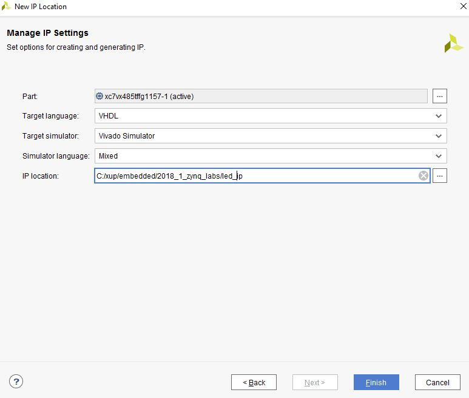
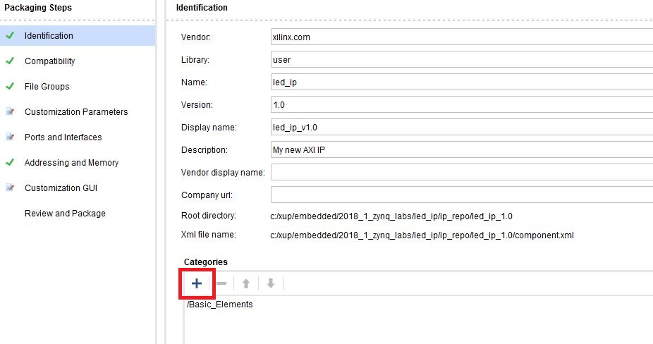
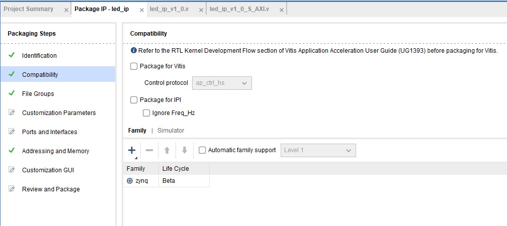
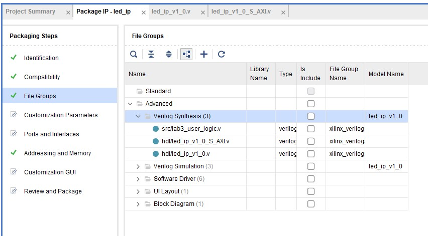
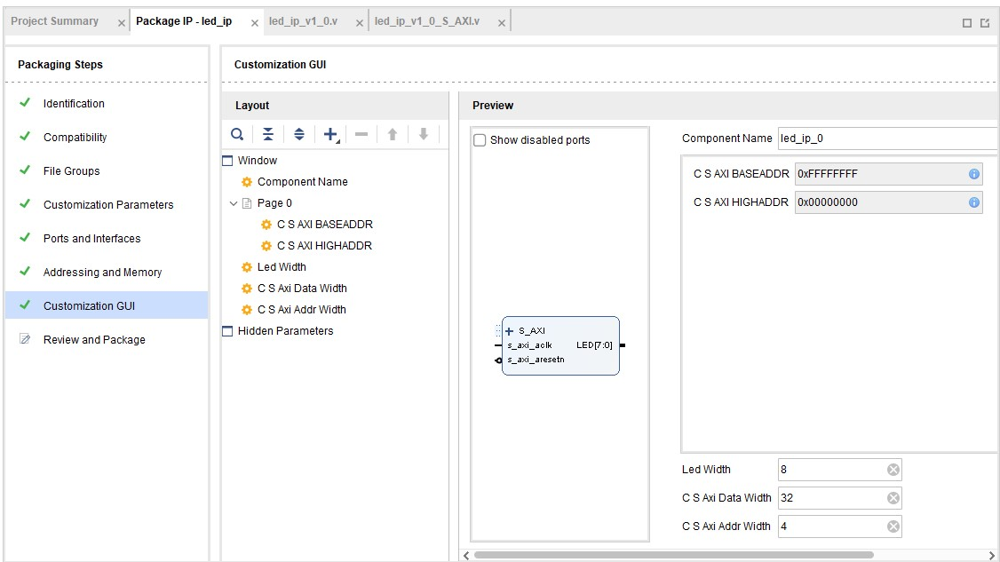
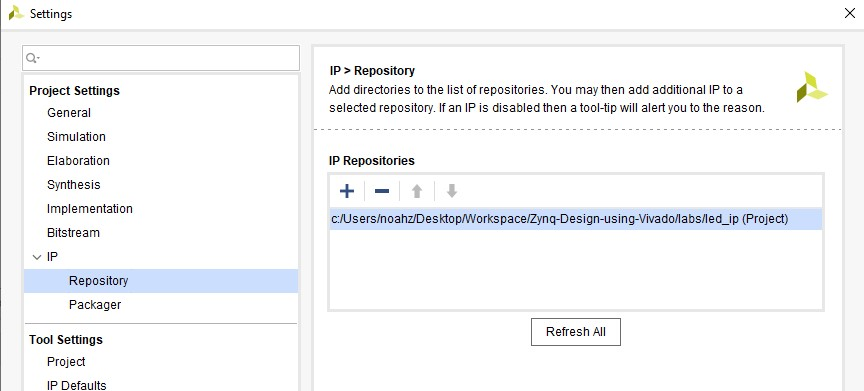
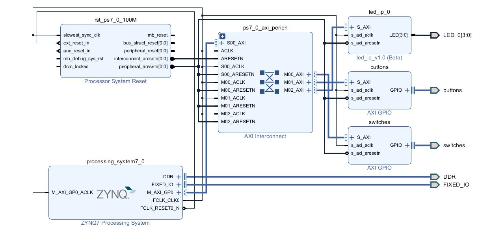
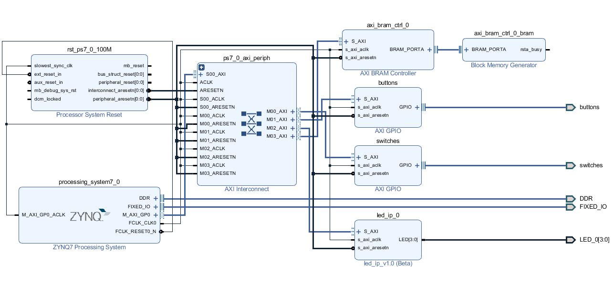

# Thêm Custom IP vào hệ thống

## Mục tiêu

Sau khi hoàn thành bài thực hành này, bạn sẽ có thể:
*   Sử dụng tính năng IP Packager của Vivado để tạo một thiết bị ngoại vi tùy biến.
*   Điều chỉnh chức năng của IP.
*   Thêm thiết bị ngoại vi tùy biến vào thiết kế.
*   Thêm các ràng buộc về vị trí của các chân.
*   Thêm khối memory vào hệ thống.

## Các bước thực hiện

#### Tạo một Custom IP sử dụng Create and Package IP Wizard

1. Mở Vivado bằng cách chọn **Start > All Programs > Xilinx Design Tools > Vivado 2021.2 > Vivado 2021.2.**
2. Ấn **Manage IP** và chọn **New IP Location**, và ấn Next ở cửa sổ New IP Location.
3. Ấn vào nút **"..."** ở mục Part. Chọn **PYNQ-Z2** rồi ấn OK.
4. Chọn **Verilog** ở mục Target language, **Mixed** ở mục Simulator language. Với mục IP location, nhập **{labs}\led_ip** và ấn Finish (các mục khác để như thiết lập mặc định và ấn OK nếu xuất hiện yêu cầu tạo thư mục).

     <p align="center">
      
     </p>
     <p align = "center">
     <i>New IP Location form (**Needs to be Updated**)</i>
     </p>

### Chạy Create and Package IP Wizard

1. Chọn **Tools > Create and Package New IP**.
2. Ấn **Next** ở cửa sổ vừa mở ra.
3. Chọn **Create a new AXI4 peripheral**, và ấn **Next**.
4. Ghi đầy đủ các thông tin của IP.

    Name: *led_ip*
	
    Display Name: *led_ip_v1_0*
	
    (Điền thêm miêu tả (description), Vendor Name, và URL)
	
5. Ấn Next.
6. Đổi tên của giao diện thành **S_AXI**.
7. Các mục khác để như thiết lập mặc định và ấn **Next** (*Lite interface, Slave mode, Data Width: 32, Number of Registers: 4*).

8. Chọn **Edit IP** và ấn **Finish** (một project Vivado mới sẽ được mở)

### Tạo một giao diện cho LED

1. Ở panel chọn source, ấn đúp vào file **led_ip_v1_0.v**.

	File này chứa code HDL cho giao diện đã được chọn ở trên. Các file thuộc tầng cao chứa một module đảm nhiệm thực thi AXI Interfacing Logic để tương tác với giao diện AXI, và một thiết kế mẫu để đọc và ghi từ một số các thanh ghi ghi được chỉ định phía trên. Template này có thể được sử dụng như một nền tảng để tạo Custom IP. Một cổng lối ra tới LED được tham số hóa mới sẽ được tạo ở tầng cao nhất của thiết kế, và dữ liệu ghi AXI trong sub-module sẽ được kết nối với cổng LED ngoại vi.
	
    Kéo xuống dòng code thứ 7, nơi mà một không gian tham số cho người dùng được cung cấp.
2. Thêm dòng lệnh sau:

    ```verilog
    parameter integer LED_WIDTH = 8,
    ```
	
3. Kéo xuống dòng 18 và thêm dòng lệnh sau:

    ```verilog
    output wire [LED_WIDTH-1:0] LED,
    ```
	> Đừng quên thêm dấu phẩy khi thêm chân.
	
4. Kéo xuống dòng 48 và thêm dòng lệnh sau:
    ```verilog
    .LED_WIDTH(LED_WIDTH),
    ```
5. Kéo xuống dòng 48 và thêm dòng lệnh sau:
    ```
    .LED(LED),
    ```
	
6. Lưu file bằng cách chọn **File > Save File**.
7. Mở rộng mã nguồn **led_ip_v1_0** nếu cần thiết, và mở file **led_ip_v1_0_S_AXI.v**.
8. Thêm tham số cho cổng và LED vào file **led_ip_v1_0_S_AXI.v** ở dòng 7 và 18 (đã hoàn thành ở bước 2 và 3).
9. Kéo xuống khoảng dòng 400 và thêm đoạn lệnh sau để khởi tạo logic người dùng cho LED IP. (Đoạn code này có thể được type vào trực tiếp hoặc copy từ file user_logic_instantiation.txt bên trong thư mục nguồn của Lab 3.)

    ```verilog
    lab3_user_logic  # (
        .LED_WIDTH(LED_WIDTH)
    )
    U1(
        .S_AXI_ACLK(S_AXI_ACLK),
        .slv_reg_wren(slv_reg_wren),
        .axi_awaddr(axi_awaddr[C_S_AXI_ADDR_WIDTH-1:ADDR_LSB]),
        .S_AXI_WDATA(S_AXI_WDATA),
        .S_AXI_ARESETN(S_AXI_ARESETN),
        .LED(LED)
    );
    ```
    Kiểm tra kỹ các tín hiệu đang được kết nối và nguồn gốc của chúng.
	
10. Lưu file bằng cách chọn **File > Save File**.
11. Ấn **Add Sources** ở cửa sổ Flow Navigator, chọn **Add or Create Design Sources**, ấn **Next**, ấn biểu tượng dấu cộng **+** rồi ấn **Add Files...**, duyệt tới **{sources}\lab3**, chọn file **ab3_user_logic.v** và ấn **OK**, cuối cùng ấn **Finish** để thêm file.

	Nhớ kiểm tra nội dung của file này để hiểu về các logic đang được thực thi. Chú ý về các cấu trúc phân tầng đã được định hình.
	
	> Đảm bảo rằng khi thêm file nguồn lab3_user_logic.v, bỏ tick ô: **Copy sources into IP directory**.
	
12. Nhấn **Run Synthesis** và **Save** nếu được yêu cầu. (Bước này đẻ kiểm tra xem thiết kế đã được tổng hợp chính xác chưa trước khi được đóng gói IP. Nếu đây là thiết kế của bản thân người dùng, nó nên được mô phòng và kiểm tra kĩ các tính năng trước khi chuyển sang các bước sau).
13. Kiểm tra xem tab Messages có bất kì lỗi nào không và sửa lại nếu cần thiết trước khi chuyển sang bước sau.

	Khi quá trình tổng hợp thực hiện thành công, bấm **Cancel**.
	
#### Đóng gói IP

1. Ấn vào tab **Package IP – led_ip**

   <p align="center">
   
   </p>
   <p align = "center">
   <i> Đóng gói IP</i>
   </p>

> Bỏ qua hai bước kế tiếp (bước 2 và 3) nếu đã xuất hiện **/Basic_Elements** bên dưới mục Categories như hình.

2. Để IP xuất hiện trên mục lục IP cho các category nhất định, IP phải được cấu hình để trở thành một phần của category đó. Để đổi category mà IP sẽ xuất hiện trong mục lục IP, ta ấn biểu tượng dấu **+** (được đánh dấu ô đỏ trên hình) ở mục **Categories**. Sau khi ấn thì cửa sổ Choose IP Categories sẽ mở ra.
3. Để phục vụ cho bài thực hành này, bỏ chọn ô **AXI Peripheral** và chọn ô **Basic Elements** và ấn **OK***.
4. Chọn **Compatibility**. Các loại Xilinx FPGA mà IP hỗ trợ sẽ hiện ra. Loại thiết bị đã được chọn sẵn cho project được lấy từ quá trình tạo IP.
5. Kết quả nhận được nên trông như thế này:
    <p align="center">
    
    </p>
    <p align = "center">
    <i> Khả năng tương thích của IP đóng gói</i>
    </p>
	>Nếu kết quả nhận được không giống như hình, ấn lại vào biểu tượng dấu **+** rồi ấn **Add Family Explicitly…** từ menu. Chọn **Zynq family** (Đây là hệ thiết bị của PYNQ-Z2) và ấn **OK***.
6. Bạn cũng có thể tùy chỉnh address space và thêm memory address space sử dụng mục **Addressing and Memory**. Tại thời điểm này sẽ không cần phải thay đổi gì.
7. Ấn **File Groups** và ấn **Merge changes** từ **File Groups Wizard**.

    <p align="center">
    
    </p>
    <p align = "center">
    <i> Khả năng tương thích của IP đóng gói</i>
    </p>

	Thao tác này để cập nhật IP Packager với thay đổi ở IP và file lab3_user_logic.v được thêm vào project. Mở rộng Verilog Synthesis và chú ý rằng file lab3_user_logic.v đã được thêm vào.
	
8. Ấn **Customization Parameters** và **Merge changes** từ Customization Parameters Wizard. Chú ý rằng các cổng (Ports) và giao diện (Interfaces) giờ sẽ hiện lên các cổng LED được tạo bởi người dùng.
9. Chọn **Customization Parameters**, mở rộng **Hidden Parameters**, ấn chuột phải vào **LED_WIDTH**, chọn **Import IP Parameters...** và ấn **OK**.
10. Chọn **Customization GUI** và chú ý tới thông số Led Width.

    <p align="center">
    
    </p>
    <p align = "center">
    <i> Giao diện cấu hình của IP được đóng gói</i>
    </p>

11. Chọn **Review and Package**, và một đường dẫn tới IP sẽ được tạo.
12. Ấn **Re-Package IP**. Ấn **Yes** và project sẽ được đóng khi hoàn thành.
13. Ở cửa sổ Vivado ban đầu, ấn **File > Close Project**.

### Sửa lỗi cho hệ điều hành Windows

>Một vài lỗi có thể gặp phải trong bài thực hành nếu người dung đang sử dụng một thiết bị chạy hệ điều hành Windows*

1. Mở file theo đường dẫn
	**{labs}\led_ip\ip_repo\led_ip_1.0\drivers\led_ip_v1_0\src\Makefile**
2. Đổi dòng 12 tới 14 thành
   ```
   INCLUDEFILES=led_ip.h
   LIBSOURCES=led_ip.c led_ip_selftest.c
   OUTS=led_ip.o led_ip_selftest.o
   ```
3. Lưu và đóng file.

### Chỉnh sửa Project Settings

1. Khởi động Vivado nếu cần thiết và mở project lab2 mà bạn đã tạo trong bài thực hành trước.
2. Chọn **File > Project > Save As…** để mở tab Save Project As. Nhập vào **lab3** cho phần tên project. Đảm bảo rằng mục **Create Project Subdirectory** đã được chọn, đường dẫn của project là  **{labs}**, ấn **OK**.
3. Ấn **Settings** trong cửa sổ Flow Navigator.
4. Chọn **IP > Repository** ở phần bên trái của cửa sổ Project Settings.
5. Ấn vào biểu tượng dấu **+**, đi tới **{labs}\led_ip** và ấn **Select**. IP có tên **led_ip_v1.0** sẽ hiện ra trong cửa sổ Selected Repository.
    <p align="center">
    
    </p>
    <p align = "center">
    <i> Chỉ định thư mục IP</i>
    </p>

6. Ấn **OK**, ấn **Apply** và ấn **OK**.

### Thêm Custom IP, BRAM, và các ràng buộc

1. Ấn **Open Block Design** dưới mục **IP Integrator** trong cửa sổ Flow Navigator.
2. Chuột phải vào cửa sổ Diagram và ấn **Add IP...**. Tìm **led_ip_v1.0** trong mục lục bằng cách type "led" trong thanh tìm kiếm.
3. Nhấn đúp **led_ip_v1.0** để thêm phần lõi mô phỏng vào thiết kế.
4. Chọn IP trong sơ đồ khối và thay đổi tên thành **led_ip** trong phần thuộc tính (properties).
5. Ấn đúp vào khối để mở ra phần thuộc tính cấu hình (configuration properties).
6. Với *PYNQ-Z2*, để width = 4.
7. Ấn **OK**.
8. Ấn **Run Connection Automation**, chọn **/led_ip/S_AXI** và ấn **OK** để tự động tạo kết nối giữa IP và AXI Interconnect.
9. Chọn cổng LED trên block **led_ip** bằng cách ấn vào chân cắm của block đó, chuột phải rồi chọn **Make External**. Đổi tên cổng thành **LED**.

    <p align="center">
    
    </p>
    <p align = "center">
    <i> Thêm và kết nối chân LED bên ngoài</i>
    </p>

10. Chọn tab **Address Editor** và kiểm tra xem đã có địa chỉ được gán tới **led_ip** hay chưa.

11. Trong sơ đồ khối (Block Diagram), ấn chuột phải rồi chọn **Add IP**. Tìm *BRAM* và thêm vào 1 khối **AXI BRAM Controller**.
12. Chạy Connection Automation trên **axi_bram_ctrl_0/S_AXI** và ấn **OK** khi được yêu cầu kết nối tới M_AXI_GP0 Master.
13. Nhấn đúp vào block để điều chỉnh số lượng giao diện **BRAM** bằng 1 và ấn **OK**.
14. Ấn **Run Connection Automation** để thêm và kết nối một **Block Memory Generator** bằng cách chọn **axi_bram_ctrl_0/BRAM_PORTA** và ấn **OK**.
15. Xác thực thiết kế bằng cách ấn **F6** để đảm bảo rằng không có bất kì lỗi nào, rồi ấn nút regenerate để vẽ lại sơ đồ. Thiết kế nên có dạng giống như hình dưới đây:
  <p align="center">
  
  </p>
  <p align = "center">
  <i> Khối thiết kế sau cùng </i>
  </p>

1. Trong mục Address editor, chú ý rằng Range của *axibramctrl_0* là 8k. Chúng ta sẽ giữ nguyên như vậy.
2. Ấn phím **F6** để kiểm tra thiết kế lần cuối
3. Ấn **Add Sources** trong cửa sổ Flow Navigator, chọn **Add or Create Constraints** rồi ấn **Next**.
4. Ấn biểu tượng dấu **+**, rồi chọn **Add Files...**, tìm tới folder **{sources}\lab3**, chọn *lab3pynq_z2.xdc for _PYNQ-Z2*.
5. Ấn **Finish** để thêm file.
6. Mở rộng thư mục **Constraints** ở cửa sổ Sources, nhấn đúp vào file **lab3_.xdc** để xem nội dung. File này chứa vị trí các chân cắm và các chuẩn vào ra (IO standards) cho các LED trên bảng mạch *Zynq*. Thông tin này cũng có thể được tìm thấy trên datasheet của bảng mạch.
7. Chuột phải vào **system.bd** và chọn **Generate output products**.
8. Ấn **Generate Bitstream** và chọn **Yes** nếu được yêu cầu lưu sơ đồ khối, và tiếp tục chọn **Yes** nếu được yêu cầu chạy **Synthesis** và **Implementation**. Ấn **Cancel** khi được yêu cầu Open the Implemented Design.

## Kết luận

Vivado IP Packager đã được sử dụng để tải vào một khối IP tùy chỉnh vào thư viện IP. Khối IP này sau đó được thêm vào hệ thống. Kết nối tự động sẽ được chạy bất cứ khi nào có thể nhằm tăng tốc quá trình thiết kế hệ thống bằng việc cho phép Vivado tự tạo kết nối giữa các IP. Thêm vào đó, một khối BRAM được thêm vào thiết kế. Cuối cùng, các ràng buộc về vị trí của chân cắm cũng được thêm vào thiết kế. Bài thực hành này được xây dựng và thử nghiệm trong Lab 4.
