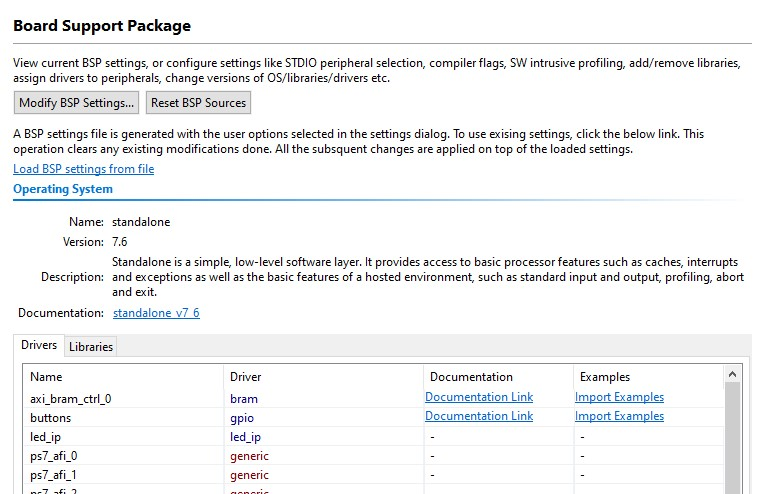
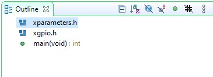
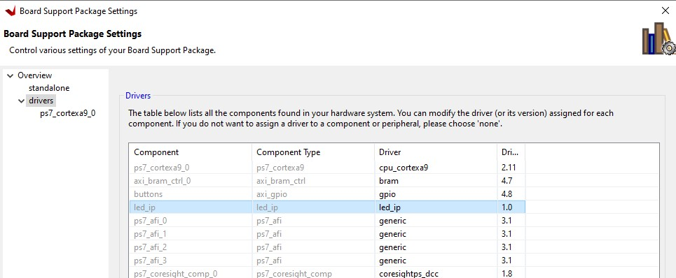
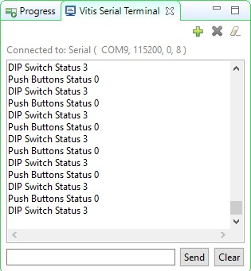

# Viết một chương trình phần mềm

## Mục tiêu của bài học:

*   Viết một ứng dụng cơ bản để điều khiển thiết bị ngoại vi trong Vitis IDE
*   Tạo được một file ELF (Excutable and Linking Format)
*   Tải xuống chuỗi bit, ứng dụng và xác minh chúng trên Zynq board

## Các bước tiến hành

### Tạo một dự án 

1.  Bật ứng dụng Vivado (nếu cần) và mở lab3 (lab3.xpr) mà bạn đã tạo từ trước.
2.  Chọn File > Project > Save As… để mở hộp thoại Save Project As. Đặt tên dự án là lab4. Chọn mục **Create Project Subdirectory** và **Include run results**, đường dẫn thư mục là **{labs}** và chọn OK.

    Các thao tác trên sẽ tạo thư mục lab4 và lưu dự án, và các thư mục liên kết với lab4.

### Xuất sang Vitis và tạo Application Project
    
1.	Chọn **File > Export > Export Hardware**.
2.	Chọn hộp thoại **Include the bitstream** và chọn **Finish**.
3.	chọn **Tools > Launch Vitis IDE** và nhấn OK.
4.	Để dọn dẹp không gian làm việc và lưu phần dự án không cần sử dụng, ấn chuột phải vào mục **lab1_system** và **lab2_system** từ dự án trước, và chọn **Close System Project**, vì những dự án này không được sử dụng trong phần này. Chúng có thể được mở lại sau nếu cần thiết.
5. 	Chọn **File > New > Application Project**. Nhấn Next để bỏ qua trang đầu nếu cần.
6.  Trong cửa sổ Platform Selection, chọn phần **Create a new platform from hardware (XSA)** và duyệt để chọn tệp **{labs}\lab4\system_wrapper.xsa** đã được xuất ra trước đó.
7.  Nhập **lab4_platform** làm _tên nền tảng_, chọn **Next.**
8.	Nhập **lab4** là tên dự án. Chọn Next.
9.  Chọn tên miền là **standalone_ps7_\***, chọn Next.
10.	Chọn Next, và chọn **Empty Application(C)** cuối cùng chọn Finish.
11.	Mở rộng **lab4** trong chế độ xem dự án và cuột phải vào thư mục **src** và chọn **Import Sources...**.
12. Duyệt để chọn thư mục **sources\lab4**, mở thư mục.
13.	Chọn tệp **lab4.c** và chọn Finish để thêm tệp vâo dự án. (Bỏ qua các lỗi).
14.	Mở tệp **lab4_platform > platform.spr** trong Explorer.
15. Chọn **Board Support Package** trong phần standalone_ps7_cortexa9_0.
16.	Chọn phần **Documentation link** tương ứng với các nút ngoại vi trong phần Trình điều khiển thiết bị ngoại vi để mở tài liệu trong cửa sổ trình duyệt mặc định. Do phần led_ip rất giống với GPIO, nên chúng ta tham khảo tài liệu bên dưới.

    <p align="center">
    
    </p>
    <p align = "center">
    <i>Tài liệu truy cập trình điều khiển thiết bị</i>
    </p>

17.	Xem các tệp C và các tiêu đề khác nhau liên quan tới _GPIO_ bằng cách truy cập vào tệp ở đầu trang.
18.	Bấm đúp chuột vào lab4.c trong Project Explorer để mở tệp. Việc này sẽ điền vào tab **Outline**.  
19.	Nháy đúp vào **xgpio.h** trong phần Outline view hiện ở bên phải màn hình và xem lại nội dung của tệp để xem các lệnh gọi hàm có sẵn cho GPIO.

    <p align="center">
    
    </p>
    <p align = "center">
    <i>Outline View</i>
    </p>


    Các bước tiếp theo phải được thực hiện trên ứng dụng của bạn để cho phép đọc thông tin từ GPIO: 1) Khởi tạo GPIO, 2) Đặt hướng dữ liệu, and 3) Đọc dữ liệu

    Tìm phần mô tả cho các hàm sau:

    **XGpio_Initialize(XGpio \*InstancePtr, u16 DeviceId)**
    _InstancePtr_ là một con trỏ tới XGpio. Bộ nhớ mà tham chiếu con trỏ phải được người gọi cấp phát trước.  Các lệnh gọi tiếp theo để thao tác thành phần thông qua API XGpio phải được thực hiện bằng con trỏ này.

    _DeviceId_ là địa chỉ id duy nhất của thiết bị được điều khiển bởi XGpio. Việc chuyển id thiết bị sẽ liên kết phiên bản XGpio chung với một thiết bị cụ thể, được chọn bởi người gọi hoặc người phát triển ứng dụng.

    **XGpio_SetDataDirection(XGpio \*InstancePtr, unsigned Channel, u32 DirectionMask)**

    _InstancePtr_ là con trỏ tới phiên bản XGpio sẽ được xử lý.

    _Channel_ bao gồm kênh của GPIO (1 hoặc 2) để hoạt động.

    _DirectionMask_ là một mặt nạ bit chỉ định bit nào là đầu vào và bit nào là đầu ra. Các bit được đặt thành 0 là đầu ra và các bit được đặt thành 1 là đầu vào.   

    **XGpio_DiscreteRead(XGpio \*InstancePtr, unsigned channel)**

    _InstancePtr_ là con trỏ tới phiên bản XGpio sẽ được xử lý.

    _Channel_ bao gồm kênh của GPIO (1 hoặc 2) để hoạt động.
20.	Mở tệp tiêu đề **xparameters.h** bằng cách nháy đúp vào **xparameters.h** trong tab Outline.

     Tệp **xparameters.h** bao gồm địa chỉ cho các thiết bị ngoại vi trong hệ thống. Tệp này được hình thành từ mô tả nền tảng phần cứng trong Vivado. Tìm **#define** sau đây được sử dụng để xác định các thiết bị ngoại vi của switch:
    ```C
    #define XPAR_SWITCHES_DEVICE_ID 1
    ```
    > Lưu ý các số có thể khác nhau.

    Lưu ý các câu lệnh **#define XPAR_SWITCHES** khác trong phần này dành cho các thiết bị ngoại vi của switch, và đặc biệt là địa chỉ của thiết bị ngoại vi xác định bởi **XPAR_SWITCHES_BASEADDR** .

21.	Sửa dòng 14 của lab4.c để sử dụng macro (#define) trong hàm XGpio_Initialize.
22.	Làm tương tự với các **BUTTONS**; tìm macro (#define) cho thiết bị ngoại vi **BUTTONS** trong **xparameters.h**, và sửa dòng 17 trong lab4.c, rồi lưu lại tệp.
	>Macro đề cập đến "pattern" cho biết cách ánh xạ một đầu vào nhất định tới đầu ra. Các macro được xác định trong tệp xparameters.h file (bạn nên xem qua).
    ```C
    14   XGpio_Initialize(&dip, XPAR_SWITCHES_DEVICE_ID); // Sửa dòng này
    15   XGpio_SetDataDirection(&dip, 1, 0xffffffff);
    16
    17   XGpio_Initialize(&push, XPAR_BUTTONS_DEVICE_ID); // Sửa dòng này
    18   XGpio_SetDataDirection(&push, 1, 0xffffffff);

    ```
23. **Build** dự án.
    >Nếu có bất kỳ lỗi nào xảy ra, hãy kiểm tra và sửa lại code của bạn. Code C của bạn sẽ đọc giá trị của các công tắc và xuất ra led_ip.

24.	Mở **lab4_platform > platform.spr** từ Explorer và nhấp vào **Board Support Package** trong standalone_ps7*, chọn **Modify BSP Settings**.
25.	Chọn **drivers** ở bên trái (trong mục Overview)
26.	Nếu trình điều khiển led_ip chưa được chọn, chọn Generic trong cột Driver cho led_ip để truy cập dropdown menu. Trong dropdown menu, chọn **led_ip**, và nhấp OK.

    <p align="center">
    
    </p>
    <p align = "center">
    <i> Gán led_ip driver </i>
    </p>

###	Kiểm tra Driver code

Mã driver được tự động tạo thành khi mẫu IP được tạo nên. Driver bao gồm các hàm cao có thể gọi từ ứng dụng người dùng. Driver sẽ triển khai các hàm thấp để điều khiển thiết bị ngoại vi của bạn.

1.	Trong windows explorer, duyệt đến đường dẫn **led_ip\ip_repo\led_ip_1.0\drivers\led_ip_v1_0\src**
Chú ý các tệp trong thư mục này và mở tệp **led_ip.c**. Tệp này chỉ bao gồm các tệp tiêu đề cho IP.
2.	Đóng led_ip.c và mở tệp tiêu đề **led_ip.h** và chú ý các macro:

    ```C
    LED_IP_mWriteReg( … )
    LED_IP_mReadReg( … )
    ```
    e.g: tìm kiếm macro có tên LED_IP_mWriteReg:

    ```C
    /**
        *
        * Write a value to a LED_IP register. A 32 bit write is performed.
        * If the component is implemented in a smaller width, only the least
        * significant data is written.
        *
        * @param   BaseAddress is the base address of the LED_IP device.
        * @param   RegOffset is the register offset from the base to write to.
        * @param   Data is the data written to the register.
        *
        * @return  None.
        *
        * @note
        * C-style signature:
        * 	void LED_IP_mWriteReg(Xuint32 BaseAddress, unsigned RegOffset,    Xuint32 Data)
        *
        */
    #define LED_IP_mWriteReg(BaseAddress, RegOffset, Data) \
            Xil_Out32((BaseAddress) + (RegOffset), (Xuint32)(Data))
    ```
    Đối với driver này, bạn có thể thấy các macro là bí danh của các hàm cấp thấp **Xil_Out32( )** và **Xil_Out32( )**. Các macro trong tệp này tạo nên các hàm cấp cao API của led_ip driver. Nếu bạn đang viết trên driver dành riêng cho IP của bạn, bạn sẽ cần sử dụng các hàm cấp thấp như thế này để đọc và ghi từ IP của mình theo yêu cầu. Các chức năng truy cập phần cứng cấp thấp được gói trong trình điều khiển của bạn giúp việc sử dụng IP của bạn trong dự án Ứng dụng trở nên dễ dàng hơn.

3.	Sửa đổi mã C của bạn (xem hình bên dưới, hoặc bạn có thể tìm code đã sửa trong tệp lab4_sol.c từ thư mục **sources\lab4** ) để lặp lại cài đặt công tắc đèn cốt trên đèn LED bằng cách sử dụng macro API trình điều khiển led_ip và lưu ứng dụng.


4.	Include tệp tiêu đề:

    ```C
    #include "led_ip.h"
    ```

5.	Include hàm để ghi vào IP (Thêm trước vòng lặp):
    ```C
    LED_IP_mWriteReg(XPAR_LED_IP_S_AXI_BASEADDR, 0, dip_check);
    ```

    Nhớ địa chỉ phần cứng cho thiết bị ngoại vi (e.g. macro **XAR_LED_IP_S_AXI_BASEADDR** trong dòng phía trên) có thể được tìm thấy trong tệp xparameters.h

    ```C
    #include "xparameters.h"
    #include "xgpio.h"
    #include "led_ip.h"
    //====================================================

    int main (void)
    {

    XGpio dip, push;
    int i, psb_check, dip_check;

    xil_printf("-- Start of the Program --\r\n");

    XGpio_Initialize(&dip, XPAR_SWITCHES_DEVICE_ID); // Modify this
    XGpio_SetDataDirection(&dip, 1, 0xffffffff);

    XGpio_Initialize(&push, XPAR_BUTTONS_DEVICE_ID); // Modify this
    XGpio_SetDataDirection(&push, 1, 0xffffffff);


    while (1)
    {
        psb_check = XGpio_DiscreteRead(&push, 1);
        xil_printf("Push Buttons Status %x\r\n", psb_check);
        dip_check = XGpio_DiscreteRead(&dip, 1);
        xil_printf("DIP Switch Status %x\r\n", dip_check);

        // output dip switches value on LED_ip device
        LED_IP_mWriteReg(XPAR_LED_IP_S_AXI_BASEADDR, 0, dip_check);

        for (i=0; i<9999999; i++);
    }
    }
    ```
6.	Lưu lại tệp và build dự án.

### Xác minh trong phần cứng

1.	Đảm bảo rằng cáp micro-USB được kết nối với bảng và máy tính. Thay đổi boot mode thành JTAG. Bật nguồn bảng.
1.Mở **Vitis Serial Terminal** và thêm kết nối vào cổng tương ứng.
1. Nháy chuột phải vào **lab4_system > lab4** và chọn **Launch Hardware (Single Application Debug)**.

4. Nháy chuột vào **Run**. Bạn sẽ thấy kết quả sau trên tab Terminal.
    <p align="center">
    
    </p>
    <p align = "center">
    <i> Kết nối cổng nối tiếp </i>
    </p>

    >Lưu ý: Điều chỉnh các công tắc DIP và nút ấn sẽ thay đổi kết quả được hiện thị.

3.	**Thoát** Vitis và Vivado.
4.	**Tắt nguồn** bảng.

## Kết luận

Sử dụng Vitis IDE để xác định, phát triển và tích hợp các thành phần phần mềm của hệ thống nhúng. Bạn có thể xác định giao diện trình điều khiển thiết bị cho từng thiết bị ngoại vi và bộ xử lý. Vitis nhập tệp XSA, tạo tệp MSS tương ứng và cho phép bạn cập nhật cài đặt để bạn có thể phát triển phần mềm của hệ thống bộ xử lý. Sau đó, bạn có thể phát triển và biên dịch phần mềm chức năng dành riêng cho thiết bị ngoại vi và tạo tệp thực thi từ mã đối tượng và thư viện đã biên dịch.
