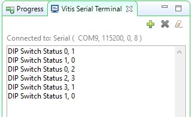
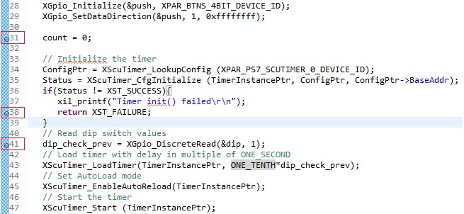
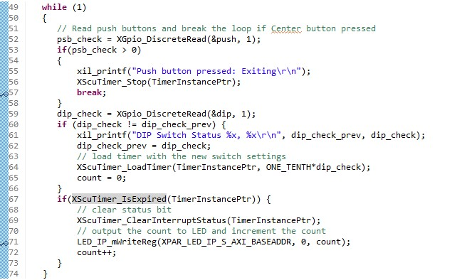
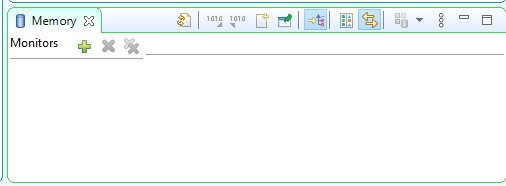
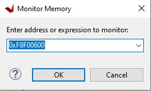
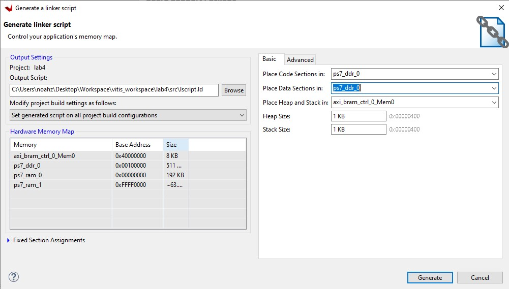

# Gỡ lỗi phát triển phần mềm

## Mục tiêu

Sau khi hoàn thành lab này bạn sẽ có thể:
* Sử dụng *Vitis Debugger* để đặt các điểm dừng và xem nội dung của biến và bộ nhớ
* Phát triển một kịch bản liên kết
* Phân chia các phần thực thi được thành cả DDR3 và BRAM

## Các bước thực hiện

### Mở dự án trong Vivado

1. Mở dự án lab4 đã làm ở trong bài lab trước, và lưu thành **lab5** trong đường dẫn **{labs}**. Đảm bảo đánh dấu lựa chọn phần **Create Project Subdirectory** và **Include run results**.

2. Mở phần *Block Design*. Vì chuỗi bit đã được tạo và sẽ ở trong đường dẫn được xuất, ta có thể bỏ qua cảnh báo về sự thay đổi trạng thái của synthesis và implementation.

3. Mở Vivado, chọn **Tools** > **Chạy Vitis IDE** 

    >Ở đây bỏ qua cửa sổ cảnh báo về việc thiết kế vẫn ở trạng thái cũ.
	
4. Chọn **Yes**.

### Tạo một dự án ứng dụng

1. Vào Explorer, nhấn chuột phải vào **lab4_system** và chọn **Close System Project**
2. Chọn **File > New > Application Project**.
3. Chọn **lab4_platform** đã tạo ở bài lab4 trước đó, nhấn *Next*
4. Đặt tên cho dự án là **lab5**, nhấn *Next*
5. Chọn domain là **standalone on ps7_cortexa9_0**. Nhấn *Next*.
6. Chọn **Empty Application(C)** và nhấn *Finish*.
7. Chọn **lab5 > src** trong *Explorer*, nhấn chuột phải và chọn **Import Sources**.
8. Tìm và chọn **{sources}\lab5**, nhấn *Select Folder*.
9. Chọn **lab5.c** và nhấn chọn hoàn thành.
10. Nhấn nút hình cái búa để xây dựng dự án.

### Xác minh hoạt động trong phần cứng
1. Đảm bảo những cáp micro-USB đã kết nối bảng mạch và PC với nhau. Thay đổi chế độ boot thành JTAG. Cấp nguồn cho bảng mạch.
2. Mở **Vitis Serial Terminal** và thêm kết nối tới cổng tương ứng. 
3. Nhấn chuột phải vào **lab5** trong Explorer và nhấn chọn **Run as > 1 Launch Hardware (Single Application Debug)**
4. Tùy thuộc vào cài đặt của công tắc ta sẽ thấy các đèn LED thực hiện chức năng của bộ đếm nhị phân với độ trễ tương ứng.
    

    
    

    

    <i> Kết quả của cửa sổ Terminal</i>
    

	>Lưu ý: Cài đặt công tắc trượt (dip switch) và nút bấm (push button) sẽ thay đổi kết quả được hiển thị. Gạt công tắc trượt và xác nhận các đèn LED sáng với độ trễ tương ứng dựa theo cài đặt công tắc. Bên cạnh đó ta thấy ở cửa sổ cuối, trạng thái cài đặt công tắc trước đó và hiện tại sẽ được hiển thị mỗi khi gạt công tắc.

### Thực hiện gỡ lỗi

1. Nhấn chuột phải vào **lab5** trong Explorer và chọn **Debug as > 1 Launch Hardware (Single Application Debug)**. Nhấn OK để thực hiện lại phiên làm việc nếu có yêu cầu
2. Nhấn đúp vào lề bên trái để đặt một điểm dừng cho các dòng trong *lab5.c*. Điểm dừng (breakpoint) được đặt khi một dấu tick và vòng tròn màu xanh xuất hiện ở lề trái bên cạnh dòng code.

    Điểm dừng đầu tiên sẽ ở vị trí mà biến đếm được khởi tạo về 0. Điểm dừng thứ hai được đặt để nhận biết lỗi nếu quá trình khởi tạo bộ định thời thất bại. Điểm dừng thứ ba được đặt khi chương trình chuẩn bị đọc cài đặt của công tắc trượt. Điểm dừng thứ tư được đặt khi chương trình chuẩn bị kết thúc do nút bấm trung tâm được nhấn. Điểm dừng thứ năm là khi bộ định thời đã chạy hết và chuẩn bị ghi vào LED.

    

    
    

    

    
    

    

    <i>Cấu hình điểm dừng</i>
    

3. Nhấn vào nút **Resume** hoặc nhấn **F8** để tiếp tục thực hiện chương trình cho tới điểm dừng đầu tiên.

    Trong phần *Variables* ta có thể thấy biến đếm có giá trị khác 0.

4. Nhấn vào nút **Step Over** hoặc nhấn **F6** để thực hiện lệnh. Khi thực hiện ta sẽ thấy giá trị biến đếm thay đổi về 0.
5. Nhấn vào nút **Resume** một lần nữa và ta sẽ thấy các dòng code đang được thực hiện và quá trình này sẽ dừng ở điểm dừng thứ ba. Điểm dừng thứ hai được bỏ qua do đã khởi tạo thành công bộ định thời. 
6. Nhấn vào nút **Step Over (F6)** để thực hiện lệnh. Khi thực hiện ta sẽ thấy giá trị biến **dip_check_prev** thay đổi thành một giá trị tùy thuộc vào giá trị cài đặt của công tắc trên bảng mạch.
7. Nhấn vào tab bộ nhớ. Truy cập bằng cách vào **Window > Show View > Memory**.
8. Nhấn vào biểu tượng dấu cộng để thêm **Memory Monitor**

    

    
    

    

    <i>Quan sát vị trí bộ nhớ</i>
    

9. Nhập địa chỉ của thanh ghi tải bộ đếm (0xF8F00600) và nhấn OK.
    

    
    

    

    <i>Quan sát một địa chỉ bộ nhớ</i>
    

    
	Có thể tìm địa chỉ bằng cách vào file *xparameters.h* để lấy địa chỉ gốc (# XPAR_PS7XPAR_PS7_SCUTIMER_0_BASEADDR1) và tìm offset bằng cách nhấn đúp vào file *xscutimer.h* sau đó nhấn đúp vào *xscutimer_hw.h* và chọn **XSCUTIMER_LOAD_OFFSET**.

10. Đảm bảo công tắc trượt **không** được đặt về "0000" và nhấn vào nút **Step Over** để thực hiện lệnh tải thanh ghi bộ định thời.

    Ta thấy địa chỉ 0xF8F00604 đã chuyển thành màu đỏ do nội dung đã thay đổi. Xác nhận nội dung phải giống với giá trị: **dip_check_prev*32500000**. Ta sẽ thấy giá trị hệ 16 tương ứng (hiển thị các byte theo thứ tự 0 --> 3).
    
    >Ví dụ với dip_check_prev = 1; giá trị là 0x01EFE920; (đảo ngược: 0x20E9EF01)

11. Nhấn nút **Resume** để tiếp tục thực hiện chương trình. Chương trình sẽ dừng khi ghi vào cổng LED (bỏ qua điểm dừng thứ tư do nút bấm chưa được nhấn).

    Ta thấy giá trị thanh ghi bộ đếm thay đổi vì bộ định thời bắt đầu chạy và quá trình đếm ngược bắt đầu.
12. Nhấn nút **Step Over** để thực hiện lệnh ghi vào cổng LED và sẽ tắt LED vì đếm = 0.
13. Nhấn đúp vào điểm dừng thứ **năm** (dùng để ghi vào cổng LED), để chương trình chạy tự do.
14. Nhấn nút **Resume** để tiếp tục thực hiện chương trình. Lần này chương trình liên tục chạy, thay đổi mẫu đèn LED sáng theo tốc độ cài đặt của công tắc.
15. Gạt công tắc để thay đổi độ trễ và quan sát hiệu ứng.
16. Nhấn một nút bấm và quan sát thấy chương trình dừng ở điểm dừng thứ tư. Nội dung thanh ghi bộ định thời và thanh ghi điều khiển hiện đỏ vì giá trị bộ đếm và giá trị thanh ghi điều khiển thay đổi do bộ định thời dừng hàm gọi. (Trong Memory monitor, có thể sẽ cần nhấn chuột phải vào địa chỉ đang được kiểm tra và nhấn *Reset* để làm mới chế độ xem bộ nhớ).
17. Kết thúc phiên làm việc bằng cách nhấn nút **Terminate**.

### Tạo kịch bản liên kết

1. Quay lại phần **Design**.
2. Nhấn chuột phải vào **lab5_system > lab5** trong Explorer và nhấn **Generate Linker Script**. Lưu ý 4 phần chính, code, dữ liệu, ngăn xếp và heap được gán cho bộ điều khiển BRAM (Block RAM).
3. Ở tab Basic đổi phần *Code and Data* thành **ps7_ddr_0**, để phần *Heap and Stack* thành **axi_bram_ctrl_0_Mem0** và nhấn **Generate**, và nhấn **Yes** để ghi đè. 
    

    
    

    

    <i>Tạo kịch bản liên kết</i>
    

4. **Rebuild** dự án .
5. Nhấn chuột phải vào **lab5_system > lab5** trong Explorer và nhấn **Run as > 1 Launch Hardware (Single Application Debug)**. Nhấn **Yes** nếu yêu cầu khởi động lại phiên làm việc. 

	>Quan sát cửa sổ Vitis Serial Terminal khi chương trình đang chạy. Gạt công tắc trượt và quan sát các LED. Thấy rằng hệ thống khá chậm trong việc hiển thị nội dung và LED nháy chậm hơn nhiều do ngăn xếp và heap là từ bộ nhớ BRAM không được lưu trữ tạm thời.*
6. Khi hoàn tất, nhấn nút *Terminate* trong tab *Console*.
7. Thoát Vitis và Vivado.
8. Ngắt nguồn bảng mạch.

## Kết luận

Lab này hướng dẫn cách phát triển phần mềm sử dụng bộ định thời riêng của CPU và đạt được chức năng mong muốn. Bạn đã xác minh chức năng trong phần cứng. Bên cạnh đó bạn sử dụng công cụ gỡ lỗi của Vitis để xem nội dung của biến và bộ nhớ, và đi qua nhiều phần của đoạn code. Nếu cần, bạn có thể sử dụng một kịch bản liên kết để tìm tới các phần trong nhiều bộ nhớ. Khi ứng dụng quá lớn so với BRAM, bạn có thể tải ứng dụng vào bộ nhớ ngoài và sau đó thực hiện chương trình.

