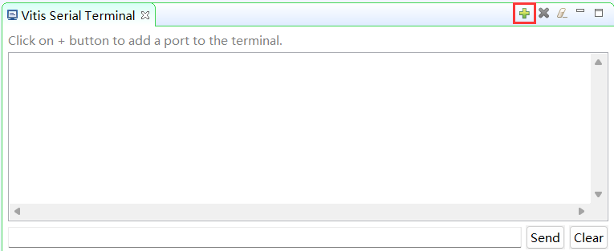
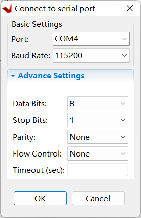

# Sửa lỗi bằng Trình phân tích phần cứng

## Đối tượng 
Sau khi hoàn thành lab này bạn có thể:

*   Thêm lõi **VIO** vào trong thiết kế
*   Sử dụng lõi **VIO** để kích thích thiết kế và theo dõi những phản hồi
*   Đánh dấu lưới như việc gỡ lỗi để giao thức AXI có thể theo dõi 
*   Thêm lõi **ILA** vào phần mềm Vivado
*   Biểu diễn gỡ lỗi phần cứng sử dụng trình phân thích phần cứng 
*   Biểu diễn phần mềm gỡ lỗi bằng cách sử dụng **Vitis IDE**

## Các bước thực hiện 

## Mở Project 

1. Khởi động **Vivado** nếu cần thiết và mở bài thực hành 2 **(lab2.xpr)** mà bạn đã tạo ra từ bài thực hành trước
2. Chọn **File > Project > Save As** ... để mở bảng thao tác **Save Project As**. Nhập lab6 là tên bài thực hành. Chắc chắn rằng tùy chỉnh **Create Project Subdirectory** đã được kiểm tra, đường dẫn thư viện bài thực hành là **{labs}** và chọn **OK**
3. Chọn Settings trong bảng *Flow Navigator* 
4. Mở rộng IP  ở phía bên trái cửa sổ *Project Settings* và chọn **Repository.**
5. Chọn nút *plus* trong bảng IP Repositories, tìm đến **{sources}\lab6\math_ip** và chọn **Select**. Thư viện sẽ được quét và một IP sẽ được phát hiện và thông báo.
    <p align="center">
    
    </p>
    <p align = "center">
    <i>Chỉ định thư mục IP</i>
    </p>
6. Nhấn chọn **OK** 2 lần để đóng cửa sổ.
   
## Thêm ví dụ GPIO cho LEDS 

1. Chọn **Open Block Design** trong bảng *Flow Navigator* để mở sơ đồ khối.
2. Thêm *AXI GPIO IP* bằng cách **Nhấn chuột phải vào cửa sổ Diagram > Add IP** và tìm AXI GPIO ở mục lục, đổi tên nó thành **leds.**
3. Nhấp chuột hai lần vào khối leds, và chọn **leds 4bits** cho giao diện GPIO và chọn OK.
4. Chọn **Run Connection Automation**, và chọn **leds** (thứ mà chứa GIPO và S_AXI). Nhấn chọn **GPIO** và **S_AXI** để kiểu tra kết nối mặc định của những giao diện này
5. Nhấn chọn OK để tự động kết nối giao diện S_AXI với cổng Zynq GP0 (Thông qua khối kết nối AXI), và cổng GPIO đến giao diện bên ngoài. Đổi tên cổng **leds_4bits** thành **leds**.
   
   Ở bước này, thiếu kế sẽ trông giống như hình minh họa ở dưới đây.
    <p align="center">
    
    </p>
    <p align = "center">
    <i>Khối thiết kế sau khi thêm LED</i>
    </p>

## Thêm Custom IP 

1. Nhấn chọn sơ đồ khối.
2. Nhấn chọn **Plus** hoặc chuột phải vào cửa sổ Diagram và chọn **Add IP**, tìm kiếm **math** ở phần hồ sơ.
3. Nhấn chuột hai lần vào **math_ip_v1_0** để thêm phiên bản của lõi cho thiết kế.
4. Nhấn chọn **Run Connection Automation**, chắc chắn rằng math_ip_0 và S_AXI được chọn, nhấn **OK.**

   *Math IP* bao gồm cấu trúc thiết kế phân cấp với bộ phận cấp thấp thể hiện phép cộng. Bộ phận cấp cao bao gồm hai thanh ghi chủ/tớ tớ.
   <p align="center">
   
   </p>
   <p align = "center">
   <i>Khối Chức Năng Chính của Lõi Tùy chỉnh</i>
   </p>

## Thêm lõi ILA và VIO 

Chúng ta muốn kết nối lõi ILA với giao diện LED. Vivado ngăn cản việc kết nối lõi ILA với giao diện. Để có thể quan sát LED tín hiệu đầu ra, chúng ta cần phải chuyển đổi giao diện LED thành cổng đầu ra đơn giản.

### Tắt giao diện LEDs.
1. Nhấp chuột hai lần vào *leds* để mở bảng tùy chỉnh của nó.
2. Nhấp chọn **Clear Board Parameters** và nhấn **OK** để đóng bảng.
3. Chọn CỔNG *leds* và xóa nó.
4. Mở rộng giao diện *gpio* của **leds** để xem các cổng liên kết.

### Làm cho cổng gpio\_io\_o của leds ngoại vi và đổi tên nó thành _leds_.
1. Di chuyển con trỏ chuột đến gần cuối của cổng gpio_io_o, chuột trái để chọn (không chọn cổng GPIO chính), và nhấp chuột phải và chọn **Make External**.
    <p align="center">
    
    </p>
    <p align = "center">
	<i>Làm cho cổng gpio_io_o ngoại vi</i>
	</p>
   
   Cổng kết nối *gpio_io_o* sẽ được tạo và kết nối.

2. Chọn cổng *gpio_io_o* và đổi tên nó thành **leds** bằng cách gõ nó vào bảng thông tin.
   
### Kích hoạt chức năng kích hoạt chéo giữa PL và PS

1. Nhấp chuột hai lần vào khối *Zynq* để mở tùy chỉnh thông tin.
2. Nhấp chọn **PS-PL Configuration**, và bật **PS-PL Cross Trigger interface**.
3. Mở rộng **PS-PL Cross Trigger interface > Input Cross Trigger**, và chọn **CPU0 DBG REQ** cho *Cross Trigger Input 0*.
4. Tương tự, mở rộng **Output Cross Trigger**, và chọn **CPU0 DBG ACK** cho *Cross Trigger Output 0* và chọn **OK**.
   <p align="center">
   
   </p>
   <p align = "center">
   <i>Bật kích hoạt chéo ở trên hệ thống xử lý Zynq</i>
   </p>

### Thêm lõi ILA và kết nối với cổng đầu ra LED.

1. Nhấp chọn **Plus** hoặc chuột phải vào cửa sổ sơ đồ và chọn **Add IP**, tìm kiếm **ila** trên thanh công cụ.
2. Nhấp chuột hai lần vào **ILA (Integrated Logic Analyzer)** để thêm bản thể cho nó. Bản thể _ila\_0_ sẽ được thêm.
3. Nhấp chuột hai lần vào bản thể _ila\_0_.
4. Lựa chọn **Native** là *Monitor type*.
5. Bật **Trigger Out Port**, và **Trigger In port**.
6. Lựa chọn cửa sổ **Probe Ports**, và chỉnh **Probe Width** của *PROBE0* thành **4** và nhấn *OK*.
7. Sử dụng công cụ vẽ, kết nối cổng **probe0** của _ila\_0_ với cổng **gpio\_io\_o** của *leds*.
8. Kết nối cổng **clk** của *ila\_0* đến cổng **FCLK\_CLK0** của hệ thống Zynq phụ.
9. Kết nối **TRIGG\_IN** của *ila\_0* với **TRIGGER\_OUT\_0** của hệ thống xử lý Zynq, và **TRIG\_OUT** của ILA đến **TRIGGER\_IN\_0**.

### Thêm lõi VIO và kết nối nó với cổng math_ip.


1. Nhấp chọn **Plus** hoặc chuột phải vào cửa sổ sơ đồ và lựa chọn **Add IP**, tìm kiếm **vio** ở thanh công cụ.
2. Nhấp chuột hai lần vào **VIO (Virtual Input/Output) để thêm bản thể cho nó.
3. Nhấp chuột hai lần vào *vio_0* để mở bảng tùy chỉnh.
4. Ở trong bảng tùy chọn tổng quát, chỉnh **Input Probe Count** thành 1 và **Output Probe Count** thành 3.
5. Lựa chọn bảng *PROBE_IN Ports* và chỉnh độ rộng *PROBE_IN0* thành 9.
6. Lựa chọn bảng *PROBE_OUT Ports* và chỉnh độ rộng của *PROBE_OUT0* thành 1, *PROBE_OUT1* thành 8, và của *PROBE_OUT2* thành 8.
7. Chọn **OK**.
8. Kết nối cổng VIO đến cổng *math instance* theo như sau :
   ``` 
   probe_in -> result
   probe_out0 -> sel
   probe_out1 -> ain_vio
   probe_out2 -> bin_vio
   ```
   
9. Kết nối cổng **CLK** của *vio_0* với mạng lưới FCLK_CKL0.
10. Sơ đồ khối sẽ giống như hình sau.
    <p align="center">
    
    </p>
    <p align = "center">
    <i>VIO được thêm và kết nối được tạo</i>
    </p>

### Đánh dấu sửa lỗi cho kết nối S\_AXI giữa mạng kết nối AXI và bản thể math\_0. Xác minh thiết kế.

1. Lựa chọn kết nối **S\_AXI** giữa mạng kết nối AXI và bản thể _math\_ip\_0_.
2. Chuột phải và lựa chọn **Debug** để theo dõi giao thức AXI4Lite.

   Để ý rằng system\_ila IP được thêm vào và M03\_AXI &lt;-&gt; S\_AXI được kết nối với giao diện SLOT_0_AXI của nó.
   
3. Nhấp chọn **Run Connection Automation** để thấy bảng tùy chỉnh mà bạn có thể lựa chọn kênh mong muốn theo dõi.
4. Đổi kênh *AXI Read Address* và *AXI Read Data* thành **Data** từ đó ta sẽ không kích hoạt bất kì tín hiệu nào của những kênh đó.

  Nguồn lưu này được sử dụng bởi thiết kế.
    <p align="center">
    
    </p>
    <p align = "center">
    <i>Lựa chọn kênh cho việc sửa lỗi</i>
    </p>
   
5. Xác minh rằng sẽ không có địa chỉ chưa được liên kết nào ở trong bảng *Address Editor*.
6. Chạy kiểm tra thiết kế (**Tools -> Validate Design**) và kiểm tra rằng nó không có lỗi nào.

	Thiết kế sẽ trông giống như sơ đồ dưới đây 
    <p align="center">
    
    </p>
    <p align = "center">
    <i>Thiết kế sau khi hoàn thiện</i>
    </p>

### Thêm ràng buộc thiết kế và tạo ra Bitstream.

1. Chuột phải vào bảng điều khiển *Sources*, và chọn **Add Sources**.
2. Lựa chọn **Add or Create Constraints** và nhấn **Next**.
3. Nhấp chọn nút *Plus* rồi **Add Files**, tìm kiếm tới **{sources}\lab6** và chọn **lab6\_pynz2.xdc.**
4. Nhấp chọn **OK* sau đó ấn **Finish**.
5. Nhấp chọn **Generate Bitstream** để chạy triển khai và tiến trình sản xuất bit.
6. Nhấp chọn **Save** để lưu dự án( nếu nó được khuyến khích), **OK** để từ chối cảnh báo (nếu nó được khuyến khích), và **Yes** để chạy tiến trình (nếu nó được khuyến khích). Nhấp chọn **OK** để chạy.
7. Khi quá trình sản xuất bitstream hoàn thành, chọn **Cancel**.

## Tạo một ứng dụng trong Vitis IDE
### Xuất thiết kế và khởi động Vitis IDE

1. Xuất tùy chỉnh phần cứng bằng cách nhấp chuột vào **File > Export > Export Hardware..**, nhấp vào hộp để **Include Bitstream**
2. Nhấp chọn **OK** để xuất và **Yes** để viết đè lên bài dự án đã tạo trước đó bởi lab2.
3. Khởi chạy Vitis IDE bằng cahs nhấp chọn **Tools > Launch Vitis IDE ** và nhấn **OK**.
4. Chuột phải vào bất kì dự án hệ thống nào đang mở, sau đó nhấn **Close System Project**.

### Tạo một dự án áp dụng trống tên là lab6, và xuất ra với lab6.c
1. Từ bảng tùy chọn File, chọn **File > New > Application Project** Chọn Next để bỏ qua trang chào mừng.
2. Trong cửa sổ lựa chọn nền tảng, lựa chọn **Create a new platform from hardware (XSA)** và duyệt để chọn file **{labs}\lab6\system_wrapper.xsa** đã được xuất ra trước đó.
3. Nhập **lab6platform** là tên the _Platform, nhấn **Next**.
4. Đtặ tên dự án là **lab6**, nhấn **Next**.
5. Ở cửa sổ chọn miền, lựa chọn **standalone_ps7_cortexa9_0**, nhấn **Next**.
6. Ở cửa sổ chọn mẫu, lựa chọn **Empty Application(C)**, nhấn **Finish**.
7. Mở rộng lab6 để ở chế độ khám phá, và chuột phải vào thư mục **src**, và lựa chọn **Import Sources**
8. Duyệt để chọn thư mục **{sources}\lab6**, nhấn chọn **Open Folder.**
9. Lựa chọn **lab6.c** và chọn **Finish**

   Một đoạn mã nguồn được thể hiện ở hình ảnh dưới đây. Nó cho ta thấy rằng hai phép toán tử được viết cho một lõi tùy chỉnh, kết quả được đọc và in ra. Giao thức được viết sẽ được sử dụng để bật điều kiện trong Vivado Logic Analyzer.
    <p align="center">
    
    </p>
    <p align = "center">
    <i>Một đoạn mã nguồn</i>
    </p>

10. Chuột phải lựa chọn **lab6** từ góc nhìn Explorer, lựa chọn **Debug As > Debug Configurations.**
11. Chuột phải lựa chọn **Single Application Debug** và chọn **New Configuration** để tạo một tùy chỉnh mới.
12. Ở trang **Target Setup**, kiểm tra tùy chọn **Enable Cross-Triggering**, và nhấn chọn nút **Browse**.
    <p align="center">
    
    </p>
    <p align = "center">
    <i>Khởi động môi trường kích hoạt chéo</i>
	</p>

13. Khi hộp thoại *Cross Trigger Breakpoints* mở, nhấn **Create**
14. Chọn tùy chỉnh như dưới đây và nhấn **OK** để cài đặt điều kiện *cross-trigger* cho * Processor to Fabric.*
    <p align="center">
    
    </p>
    <p align = "center">
	<i>Bật CPU0 cho yêu cầu từ PL</i>
	</p>

15. Ở hộp thoại *Cross Trigger Breakpoints* nhấp chọn **Create**
16. Chọn tùy chỉnh như hình dưới đây và nhấn chọn **OK** để cài đặt điều kiện *cross-trigger* cho *Fabric to Processor*.
    <p align="center">
    
    </p>
    <p align = "center">
	<i>Bật CPU0 cho yêu cầu đến PL</i>
	</p>

17. Nhấn **OK**, sau đó nhấn **Apply**, và cuối cùng là **Close**
18. Xây dựng dự án bằng cách nhấn vào nút *Hammer* hoặc nhấp chuột phải vào **lab6** từ Chế độ Xem Trình duyệt và chọn **Build Project.**

## Kiểm tra ở phần cứng
### Bắt đầu gỡ lỗi và thiết lập giao tiếp nối tiếp
1. Kết nối và cấp nguồn cho mạch với chế độ JTAG.
2. Lựa chọn dự án **lab6** ở * Explorer View*, chuột phải và chọn ** Debug As > Launch Hardware (Single Application Debug)** để tải ứng dụng. Chạy chương trình và tạm dừng ở *entry point*.
3. Nhấn **Window > Show View**, tìm kiếm và mở **Vitis Serial Terminal.**
4. Nhấp chọn nút *Add* để kết nối tới cổng.
    <p align="center">
    
    </p>
    <p align = "center">
	<i>Thêm cổng nối tiếp</i>
	</p>
	   
5. Lựa chọn **Port** từ menu dropdown. Để cài đặt nâng cao là *as-is*. Nhấn **OK**.
   <p align="center">
   
   </p>
   <p align="center">
   <i>Kết nối tới cổng nối tiếp</i>
   </p>
   
### Bắt đầu trình phần cứng với Vivado

1. Chuyển thành Vivado.
2. Nhấn chọn **Open Hardware Manager** từ bảng *Flow Navigator* để kich hoạt phân tích.
3. Nhấn chọn **Open Target > Auto connect** để xây dựng sự kết nối với bảng.
4. Lựa chọn **Window > Debug Probes**
   Trình phần cứng sẽ mở ra và thể hiển bảng **Debug Probes** ở chế độ **Console**.
   <p align="center">
   
   </p>
   <p align="center">
   <i>Debug Probes</i>
   </p>
   
   Cửa sổ trạng thái của trình phần cứng cũng sẽ mở cho thấy FPGA đã được lập trình (Ta đã làm nó bằng Vitis IDE), hai trong ba lõi là ở trạng thái *idle*.
   <p align="center">
   
   </p>
   <p align="center">
   <i>Trạng thái của trình phần cứng</i>
   </p>
   
5. Lựa chọn XC7Z020, và nhấn vào nút **Run Trigger Immediate** để thấy tín hiệu từ cửa sổ dạng sóng.
   <p align="center">
   
   </p>
   <p align="center">
   <i>Mở cửa sổ dạng sóng</i>
   </p>
   
### Cài đặt điều kiện cho kích hoạt ILA cho *hw_ila_a*
1. Nhấn chọn thẻ **hw\_ila\_2**. Trong cửa sổ **Debug Probes**, dưới _hw\_ila\_2_, kéo và thả tín hiệu **WDATA** sang cửa sổ **Trigger setup**.
2. Chỉnh giá trị thành **XXX\_XX12** (HEX)(giá trị được viết trong math'_0 instance tại dòng 24 của lab6.c)
   <p align="center">
   
   </p>   
   <p align="center">
   <i>Cài đặt kích hoạt</i>
   </p>
   
3. Tương tự, thêm **WREADY,WSTRB** và **WVALID** vào cửa sổ **Trigger Setup**.
4. Chuyển cơ số thành **[B](Nhị Phân)** cho **WSTRB**, và đổi giá trị từ **XXXX** thành **XXXX1**.
5. Thay đổi giá trị của **WVALID** và **WREADY** thành 1.
6. Chỉnh vị trí của *trigger* của _hw\_ila\_2_ thành **512** ở trong cửa sổ _**Settings** - hw\_ila\_2_
   <p align="center">
   
   </p>   
   <p align="center">
   <i>Cài đặt ILA</i>
   </p>
   
7. Tương tự, chỉnh vị trí *Trigger* ở trong cửa sổ **Settings** *-hw_ila_1* thành **512**
8. Chọn **hw\_ila\_2** ở trong cửa sổ *Hardware* và chọn **Run Trigger** và quan sát lõi _hw\_ila\_2_ được trang bị và thể hiện rằng trạng thái là **Waiting For Trigger**
   <p align="center">
   
   </p>   
   <p align="center">
   <i>Hardware Analyzer chạy và trong chế độ ghi lại</i>
   </p>
   
9. Đổi qua Vitis IDE.
10.  Gần dòng 27, nhấn chuột hai lần vào viền trái của dòng có lệnh *xil_printf* được định nghĩa trong lab6.c để cài đặt *breakpoint*.
	<p align="center">
	
    </p>   
	<p align="center">
	<i>Cài đặt breakpoint</i>
	</p>
   
1.  Nhấn nút **Resume (F8)** để chạy chương trình và dừng lại tại *breakpoint* (điểm ngắt).
2.  Trở lại Vivado, để ý rằng trạng thái **hw\_ila\_2** chuyển từ **Waiting for Trigger** thành **Idle**, và cửa sổ dạng sóng cho thấy đầu ra kích hoạt (chọn thẻ _hw\_ila\_data\_2.wcfg_ nếu cần thiết).
3.  Di chuyển con trỏ tới gần điểm kích hoạt và nhấn vào nút **Zoom In** để phóng to vị trí con trỏ. Nhấp vào nút **Zoom In** vài lần để thấy hoạt động cạnh điểm kích hoạt. Tương tự, bạn có thể thấy các hoạt động khác bằng cạnh cuộn sang trái theo nhu cầu.
    <p align="center">
    
    
    
    </p>
    <p align = "center">
	<i>Phóng lớn dạng sóng của cả ba giao thức AXI</i>
	</p>
   
   Quan sát như sau:

	Xung quang mẫu thứ 512 WDATA được viết là 0x012 ở offset 0 (AWADDR=0x0). 
	Ở mẫu thứ 536, offset là 0x4 (AWADDR), và dữ liệu được viết là 0x034.
	Ở mẫu thứ 559, dữ liệu được đọc từ IP ở offset 0x0 (ARADDR), và ở mẫu thứ 561 đánh dấu kết quả (0x46) ở trên RDATA bus.

### Tương tác với lõi VIO ở trong Vivado

1. Trong Vivado, chọn lõi **hw_vio_1** trong bảng điều khiển *Dashboard Options*.
2. Nhấn chọn nút **Add** và chọn tất cả sóng của vio để mô phỏng và quan sát. Thay đổi giá trị của **vio_0_probe_out0** thành **1** để đầu ra lõi math_ip có thể điều khiển thông qua lõi VIO.
   <p align="center">
   
   </p>   
   <p align="center">
   <i>Cảm biến VIO </i>
   </p>

3. Thay đổi giá trị **vio\_0\_probe\_out1** thành **55** (trong hệ HEX), và tương tự, giá trị **vio\_0\_probe\_out2** thành **44** (trong hệ HEX). Để ý lúc mũi tên màu xanh hướng lên sẽ xuất hiện ở trên cột *Activity* và giá trị đầu ra đổi thành **099** (trong hệ HEX).
	<p align="center">
    
    </p>   
	<p align="center">
	<i>Đầu vào tác động thông qua cảm biến lõi VIO</i>
	</p>

4. Thử vài giá trị vào khác và quan sát kết quả.
5. Một khi đã xong, chỉnh *vio_0_probe_out0* thành 0 để phân tách tương tác vio với lõi math_ip.

### Cài đặt điều kiện kích hoạt ILA cho hw_ila_1

1. Chọn **hw_ila_1** trong bảng điều khiển *Dashboard Options*
2. Thêm LEDs vào **Trigger Setup**, và chỉnh điều kiện kích hoạt của *hw_ila_1* thành điều kiện tại giá trị đầu ra của LED bằng **0x5** cho PYNQ-Z2.
   <p align="center">
   
   </p>   
   <p align="center">
   <i>Cài đặt Kích hoạt cho hw_ila_1</i>
   </p>

3. Chắc chắn rằng vị trí kích hoạt cho *hw_ila_1* dược chỉnh là **512**.

   >Chắc chắn rằng các công tắc không chỉnh thành 11 ở trong PYNQ-Z2 vì đây là kiểu thoát ra.
  
4. Chuột phải vào **hw_ila_1** ở cửa sổ *hardware*, và trang bị kích hoạt bằng cách chọn **Run Trigger**. Trình phân tích phần cứng nên được đợi cho điều kiện kích hoạt xảy ra.
5. Ở cửa sổ Vitis IDE Debug, nhấp vào nút **Resume (F8)**.
6. Nhấn các nút push và xem các LED tương ứng BẬT và TẮT.
7. Khi gặp điều kiện, dạng sóng sẽ được hiện ra.
   <p align="center">
   
   </p>   
   <p align="center">
   <i>Cửa sổ dạng sóng ILA sau khi kích hoạt</i>
   </p>

### Kích hoạt trình gỡ lỗi chéo cho phần cứng và phần mềm
1. Ở trong Vivado, chọn **hw\_ila\_1**
2. Ở trong cửa sổ **ILA properties**, mở rộng **CONTROL**, chỉnh _TRIGGER\_MODE_ thành **BASIC\_OR\_TRIGG\_IN**, và _TRIG\_OUT\_MODE_ thành **TRIGGER\_OR\_TRIG\_IN**
   <p align="center">
   
   </p>   
   <p align="center">
   <i>Thông tin lõi ILA</i>
   </p>

3. Ở trong Vitis IDE, ở chế độ Design, tái khởi động phần mềm bằng cách chuột phải vào dự án lab6, và chọn ** Debug As > Launch Hardware (Single Application Debug)**. Nhấn **OK** nếu nó được gợi ý khởi động lại.

	Chương trình sẽ được tải và sẽ dừng lại tại điểm vào.
	
4. Trang bị kích hoạt *hw_ila_1* bằng cách nhấn vào **Run Trigger**.
5. Trong Vitis IDE, tiếp tục trình chạy của phần mềm cho đến điểm dừng tiếp theo (dòng 27).

   Khi tới điểm dừng tiếp theo, quay trở lại Vivado và để ý rằng ILA đã được kích hoạt.

### Kích hoạt ILA và làm phần mềm dừng lại
1. Nhấp chọn nút **Step Over (F6)** hai lần để đi qua điểm dừng hiện tại.
2. Trang bị kích hoạt _hw\_ila\_1_ bằng cách nhấn vào **Run Trigger**.
3. **Resume (F8)** phần mềm cho đến khi nó tự vào vòng lặp while.
4. Nhấn nút push đến **0x5**, và để ý rằng ứng dụng trong Vitis IDE sẽ dừng lại tại vài điểm (Điểm này sẽ ở đâu đó trong vòng lặp while).
5. Nhấn vào nút **Resume**. Chương trình sẽ tiếp tục chạy. Lật các công tắc cho đến khi nó là **0x03**.
6. Nhấn chọn nút **Disconnect** ở trong Vitis IDE để dừng chạy.
7. Đóng Vitis IDE bằng cách chọn **File > Exit.**
8. Ở trong Vivado, tắt trình phần cứng bằng cách chọn **File > Close Hardware Manager**, và nhấn **OK**.
9. Đóng Vivado bằng cách chọn **File > Exit**
10. Tắt nguồn của bảng.

## Tổng Kết

Trong bài thực hành này, bạn thêm lõi tùy chỉnh với cổng phụ để có thể gỡ lỗi bằng cách sử dụng lõi VIO. Bạn khởi tạo lõi ILA và VIO vào thiết kế. Bạn dùng chức năng Mark Debug của Vivado để gỡ lỗi gaio thức AXI ở trên thiết bị ngoại vi tùy chỉnh. Bạn sau đó mở trình phần cứng từ Vivado, cài đặt đa nhân, và xác minh thiết kế và lõi bằng cách sử dụng Vitis IDE và trình phân tích phần cứng.
