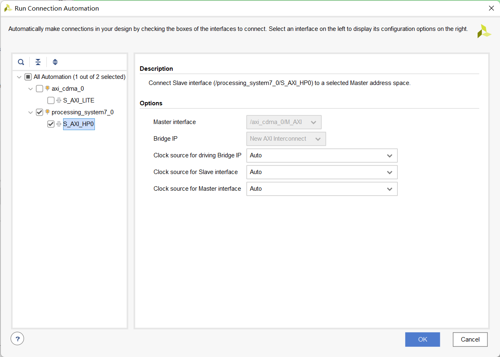
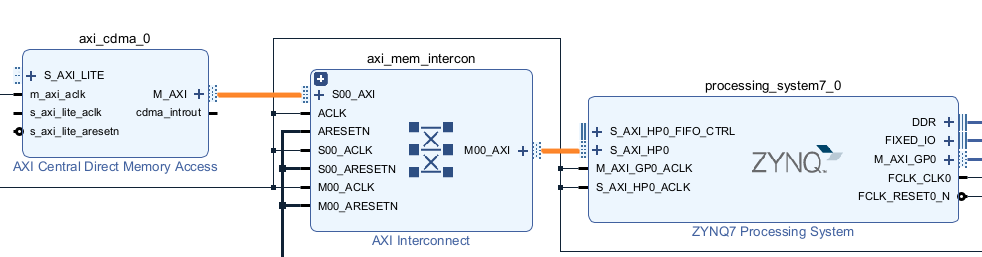
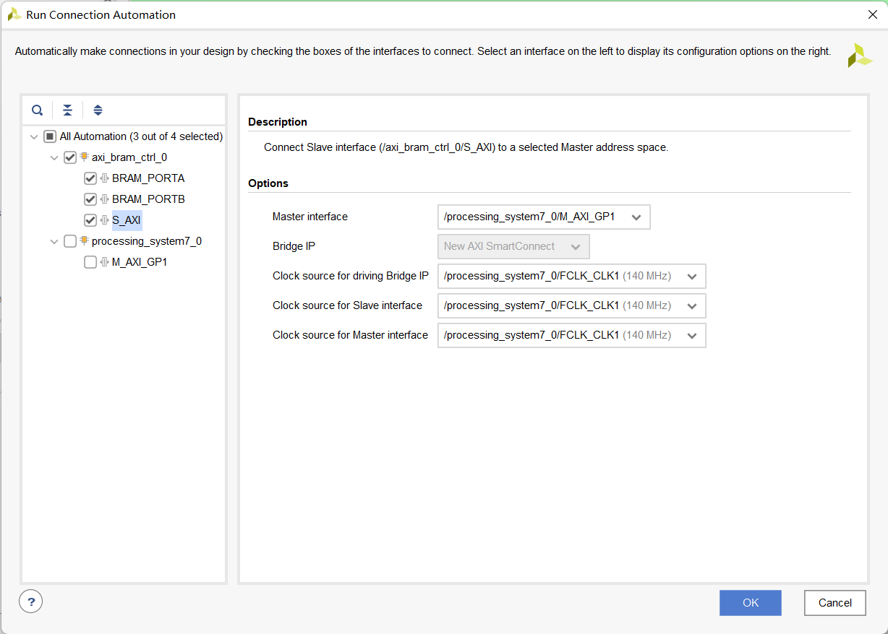
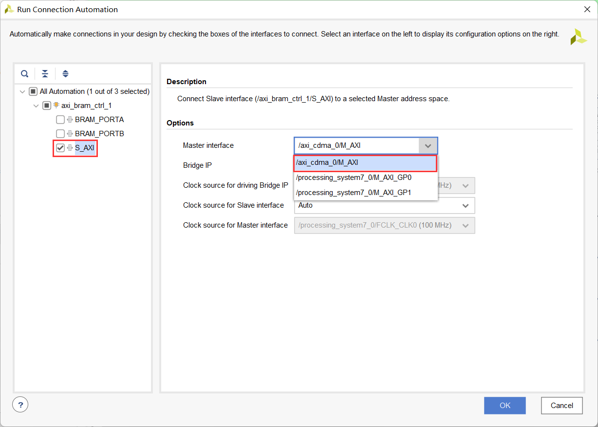
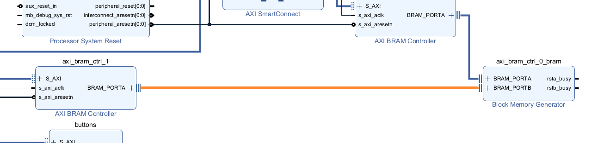
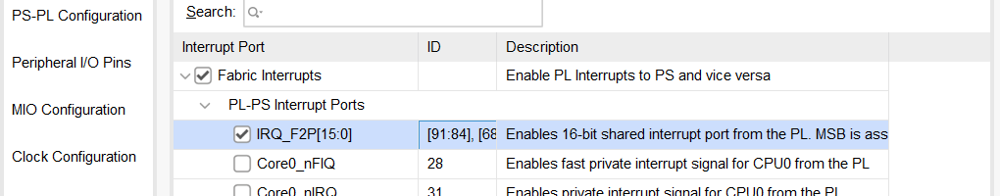
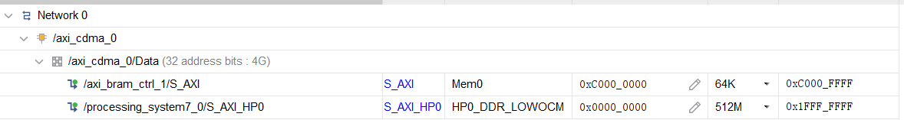
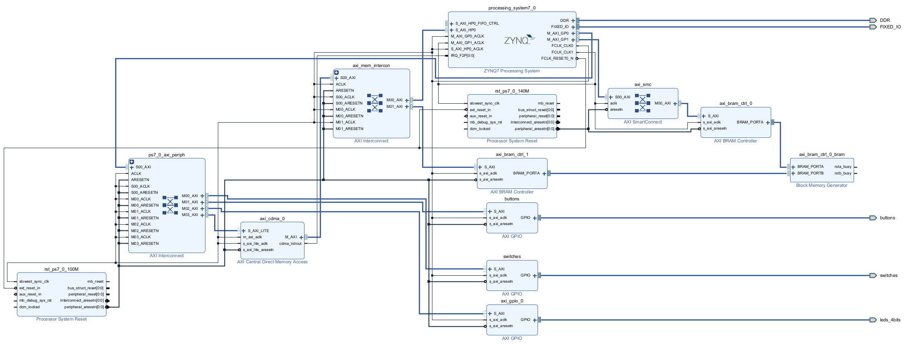
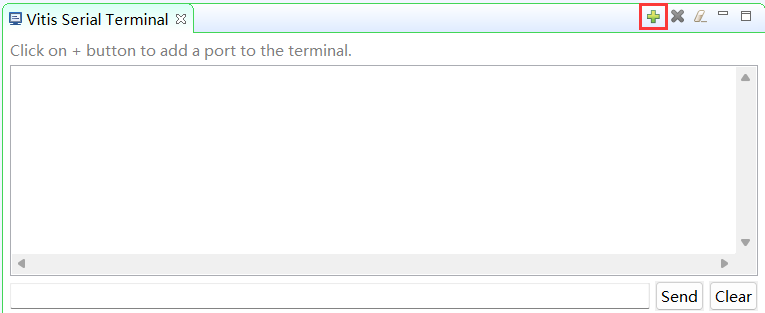
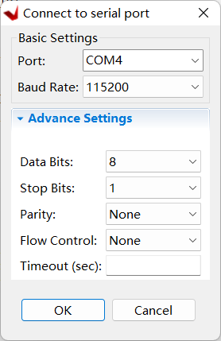

# Truy cập bộ nhớ trực tiếp sử dụng CDMA

## Mục tiêu

Sau khi hoàn thành bài thực hành này, bạn sẽ có khả năng:

Kích hoạt một cổng High Performance (HP) của hệ thống xử lý (PS).
Thêm và kết nối bộ điều khiển CDMA trong lô-gíc lập trình được (PL).
Thực hiện hoạt động truy cập bộ nhớ trực tiếp (DMA) giữa các bộ nhớ khác nhau.
## Các bước thực hiện
## Mở project       
1. Khởi động Vivado nếu cần và mở dự án lab2 (lab2.xpr) mà bạn đã tạo trong bài thực hành trước đó.
2. Chọn **File > Project > Save As …** để mở hộp thoại Save Project As . Nhập **lab7** làm tên dự án.  Đảm bảo rằng tùy chọn **Create Project Subdirectory** được chọn, đường dẫn thư mục dự án là **{labs}** và nhấn **OK.**

## Thêm thực thể GPIO cho các đèn LED
1. Nhấp vào **Open Block Design** trong phần _Flow Navigator_ để mở sơ đồ khối.
2. Thêm một thực thể _AXI GPIO_ IP bằng cách **chuột phải vào cửa sổ Diagram  > Add IP** và tìm kiếm AXI GPIO trong danh mục, đổi tên thành **leds**.
3. Nhấp đúp vào khối leds và chọn **leds 4bits** cho giao diện GPIO, sau đó nhấn OK.
4. Nhấp **Run Connection Automation**, và chọn **leds** (bao gồm GPIO và S\_AXI). Nhấp vào **GPIO** và **S\_AXI** để kiểm tra các kết nối mặc định cho các giao diện này.
5. Nhấp OK để tự động kết nối giao diện S_AXI với cổng Zynq GP0 (qua khối AXI interconnect), và cổng GPIO với một giao diện bên ngoài. Đổi tên cổng **leds_4bits** thành **leds**.

## Cấu hình Vi xử lý (Processor)
1. Nhấp đúp vào mục _Zynq processing system_ để mở cấu hình mẫu.
2. Chọn **PS-PL Configuration** trong cửa sổ Page Navigator ở bên trái, mở rộng phần **HP Slave AXI Interface** ở bên phải, và đánh dấu vào ô **S AXI HP0 Interface** để kích hoạt giao diện này.
3. Mở rộng **AXI Non Secure Enablement > GP Master AXI Interface** và kích hoạt **M AXI GP1 Interface**.
4. Chọn **Clock Configuration** trong cửa sổ Page Navigator ở bên trái, mở rộng phần **PL Fabric Clocks** ở bên phải, kích hoạt **FCLK\_CLK1**. Nhập **Requested Frequency** cho FCLK_CLK1 là **140 MHz**.
5. Nhấp **OK** để áp dụng các thay đổi và đóng cấu hình mẫu.

## Thêm CDMA và bộ nhớ BRAM        
### Khởi tạo Bộ Điều Khiển AXI central DMA.
1. Nhấp vào nút **Plus** hoặc chuột phải vào cửa sổ Diagram và chọn **Add IP**, tìm kiếm **Central** . Nhấp đúp vào **AXI Central Direct Memory Access** để thêm một thực thể vào thiết kế.
2. Nhấp đúp vào thực thể _axi\_cdma\_0_ bỏ chọn tùy chọn **Enable Scatter Gather** .
3. Thay đổi _Write/Read Data Width_ thành **64** và nhấp **OK**.

    >Lưu ý rằng kích thước burst đã thay đổi từ 16 xuống 8. Bạn có thể tăng giá trị này lên 256 để cải thiện hiệu suất. Ở đây, chúng tôi sử dụng kích thước nhỏ nhất vì ứng dụng cho phép vận chuyển sôs lượng nhỏ các words.

### Chạy tự động kết nối(Run connection automation)
Tự động kết nối có thể chạy trên tất cả các cổng chưa được kết nối cùng một lúc. Tuy nhiên, với mục đích của bài thực hành này, mỗi cổng sẽ được kết nối một cách riêng lẻ để theo dõi dễ dàng các thay đổi được thực hiện bởi quá trình tự động kết nối.

1. Nhấp vào **Run Connection Automation** và chọn **processing\_system7\_0/S\_AXI\_HP0**
2. Kiểm tra xem cổng này có được kết nối với cổng _/axi\_cdma\_0/M\_AXI_ và nhấp **OK**.
    

    
    

    

    <i>Tự động kết nối</i>
    

3. Xác nhận kết nối CDMA thông qua AXI SmartConnect đến cổng HP0
    

    
    

    

    <i>Kết nối Bộ Điều Khiển AXI central DMA với S_AXI_HP0</i>
    

    >Chú ý rằng khi một thực thể của AXI SmartConnect (axi_smc_1) đã được thêm vào, S_AXI_HP0 của processing_system7_0 được kết nối với M00_AXI của axi_smc_1, S00_AXI của axi_smc_1 được kết nối với m\_axi của thực thể axi_cdma_0.  Ngoài ra, m_axi_aclk của axi_cdma_0 được kết nối với đường dẫn xuất phát từ FCLK_CLK0 của processing_system7_0.

4. Nhấp vào **Run Connection Automation** lần nữa, và chọn **/axi\_cdma\_0** (bao gồm **S\_AXI\_LITE** ). Nhấp **OK**.

    >Chú ý rằng không thể chọn cổng axi\_cdma\_0/M\_AXI nữa. Điều này xảy ra vì cổng này đã được kết nối với hệ thống xử lý trong bước trước đó.

### Khởi tạo Hai Bộ Điều Khiển BRAM và hai bộ nhớ BRAM.
1. Nhấp vào nút **Add** hoặc chuột phải vào cửa sổ Diagram và chọn **Add IP**, tìm kiếm **BRAM** trong danh mục. Nhấp đúp vào **AXI BRAM Controller** để thêm một thực thể vào thiết kế.
2. Nhấp vào **Run Connection Automation** , và chọn **axi_bram_ctrl_0**
3. Nhấp vào các ô **BRAM_PORTA** và **BRAM_PORTB**.
4. Nhấp vào **S\_AXI** , và thay đổi tùy chọn _Master Interface_ thành **/processing\_system7\_0/M\_AXI\_GP1**, thay đổi _Clock source for driving interconnect IP, Clock source for Master interface,_ và _Clock source for Salve interface_ thành **/processing\_system7\_0/FCLK\_CLK1 (140 MHz)** vì tất cả chúng chạy với chung một clock, và Nhấp vào **OK**.
    

    
    

    

    <i>Kết nối bộ điều khiển BRAM theo chuẩn AXI với M_AXI_GP1 để chạy ở tần số clock lớn hơn.</i>
    

    > Chú ý rằng khu một thực thể của AXI SmartConnect và Processor System Reset được thêm vào, M_AXI_GP1_ ACLK được kết nối với FCLK_CLK1.

5. Thêm một **AXI BRAM Controller** nữa bằng cách nhấp vào nút **Add** và tìm kiếm **BRAM**.
6. Nhấp vào **Run Connection Automation** , và chỉ chọn **/axi\_bram\_ctrl\_1/S\_AXI**.
7. Đối với _Master_ connection, chọn **axi\_cdma\_0/M\_AXI** từ hộp thả xuống.
    

    
    

    

    <i>Tự động kết nối BRAM</i>
    

8. Nhấp vào **OK** để tạo kết nối.
9. Nhấp đúp vào thực thể _axi\_bram\_ctrl\_1_ thay đổi _Number of BRAM Interface_ thành **1**. Thay đổi _Data Width_ thành **64** và nhấp vào **OK**.
10. Nhấp đúp vào thực thể _axi\_bram\_ctrl\_0_ và đồng thời cũng thay đổi _Number of BRAM Interface_ thành **1** và thay đổi _Data Width_ thành **64**. Nhấp vào **OK**.
11. Sử dụng công cụ dây, kết nối **BRAM\_PORTA** của thực thể _axi\_bram\_ctrl\_1_ với **BRAM\_PORTB** của thực thể Block Memory Generator _axi\_bram\_ctrl\_0\_bram_ .
    

    
    

    

    <i>Kết nối tới bộ điều khiển BRAM thứ hai</i>
    

### Kết nối cổng ngắt ra của CDMA tới cổng của bộ xử lý.
1. Nhấp đúp vào thực thể _processing\_system7\_0 instance_ để mở cấu hình mẫu của nó.
2. Chọn **Interrupts** trong cửa sổ Page Navigator ở ô bên trái, đánh dấu vào ô **Fabric Interrupts** .
3. Mở rộng **Fabric Interrupts &gt; PL-PS Interrupts Ports**, đánh dấu vào ô **IRQ\_F2P**.
    

    
    

    

    <i>Kích hoạt cổng ngắt cho bộ xử lý</i>
    

4. Nhấp vào **OK**.
5. Nối dây, kết nối **cdma\_introut** tới cổng **IRQ\_F2P** . (Nhấp vào cổng _cdma\_introut_ rồi kéo nó vào cổng _IRQ\_F2P_ )

### Đặt kích thước của bộ xử lý BRAM thành 64KB.
1. Chọn thẻ (tab) **Address Editor** .
2. Mở rộng _axi\_cdma\_0&gt; Data_ section, và thay đổi kích thước bộ nhớ của _axi\_bram\_ctrl\_1_ thành **64K**.
    

    
    

    

    <i>Không gian địa chỉ</i>
    

3. Thiết kế sẽ giống như hình dưới đây.
    

    
    

    

    <i>Thiết kế sau khi đã hoàn thành</i>
    

4. Chọn thẻ (tab) _Diagram_ , và nhấp vào **Validate Design (F6)** để đảm bảo không có lỗi gì xảy ra.

## Tạo chuỗi bit        
1. Nhấp vào **Generate Bitstream** để chạy quy trình tổng hợp (Synthesis), thực thi (Implementation), và tạo chuỗi bit (Generate Bitstream).
2. Nhấp vào **Save** để lưu dự án, và **Yes** nếu có thông báo để chạy các quy trình. Nhấp vào **OK** để bắt đầu quá trình chạy.
3. Khi quá trình tạo chuỗi bit hoàn thành, nhấp vào **Cancel**.

## Tạo Ứng Dụng Trong Vitis IDE
### Xuất thiết kế đã được thực thi và khởi chạy SDK
1. Xuất cấu hình phần cứng bằng cách nhấp vào **File &gt; Export &gt; Export Hardware…**
2. Đánh dấu vào ô **Include Bitstream** và nhấp vào **OK** (nhấp vào Yes nếu có thông báo để ghi đè lên phiên bản trước đó).
3. Khởi chạy Vitis IDE bằng cách nhấp vào **Tools &gt; Launch Vitis IDE** và nhấp vào **OK**.
4. Để làm mới không gian làm việc, chuột phải vào từng dự án hệ thống đã mở và chọn **Close System Project**.

### Tạo một dự án ứng dụng trống rỗng (empty application project), đặt tên là lab7, và nhập dữ liệu từ tệp (import file) lab7.c đã được cung cấp.
1. Từ danh mục (menu) File, chọn **File > New > Application Project**. Nhấp vào Next để bỏ qua trang chào đón nếu cần.
2.  Trong cửa sổ Platform, chọn **Create a new platform from hardware (XSA)** và browse đến file **{labs}\lab7\system_wrapper.xsa** đã được xuất trước đó.
3. Nhập **lab7_platform** làm _Platform name_, nhấp vào **Next.**
4. Đặt tên dự án là **lab7**, nhấp vào **Next**.
5. Trong cửa sổ chọn miền, chọn **stvàalone_ps7_cortexa9_0**, nhấp vào **Next**.
6. Trong cửa sổ chọn mẫu, chọn **Empty Application(C)**, nhấp vào **Finish**.
7. Mở rộng **lab7** trong Explorer view, và chuột phải vào folder **src** , và chọn **Import Sources...**.
8. Duyệt đến thư mục (Browse to folder) **{sources}\lab7**, nhấp vào **Open Folder**.
1. Chọn **lab7.c** và Nhấp vào **Finish**. 
1. Xây dựng dự án (project) bằng cách nhấp vào nút có hình cái búa (Hammer) hoặc chuột phải vào **lab7** từ Explorer View và chọn **Build Project**.

## Test trên Phần cứng
### Thiết lập giao tiếp nối tiếp   
1. Kết nối và bật nguồn cho bo mạch ở chế độ JTAG.
1. Nhấp vào **Window > Show View**, tìm và mở **Vitis Serial Terminal**.
1. Nhấp vào **Add** để kết nối với một cổng.
    

    
    

    

    <i>Thêm một cổng nối tiếp</i>
    

1. Chọn **Port** trong phần Thiết lập Cơ bản (Basic Settings). Giữ nguyên các Thiết lập Nâng cao (Advanced Settings). Nhấp vào **OK**.
    

    
    

    

    <i>Kết nối tới một cổng nối tiếp</i>
    

### Chạy ứng dụng lab7 từ bộ nhớ DDR3.
1. Chuột phải vào **lab7** từ Explorer View và chọn **Run as > Launch Hardware (Single Application Debug)**.
1. Dựa theo danh mục (menu) trong cửa sổ mô phỏng terminal và thử nghiệm chuyển giao dữ liệu giữa các bộ nhớ khác nhau.
1. Chọn tùy chọn 4 trong danh mục (menu) để hoàn tất quá trình thực thi.
1. Đóng Vitis IDE và Vivado
1. Tắt nguồn bo mạch.

## Kết luận

Bài thực hành này hướng dẫn bạn toàn bộ quá trình thêm một bộ điều khiển CDMA vào Hệ thống xử lý (PS) để thực hiện các truyền tải (transfers) DMA giữa các khu vực bộ nhớ khác nhau. Bạn đã sử dụng cổng hiệu suất cao (high-performance) để có thể thực hiện Truy cập bộ nhớ trực tiếp (DMA) giữa các khối BRAM nằm trong phần Lô-gíc lập trình được (PL) với bộ nhớ DDR3 đã được kết nối sẵn với Hệ thống xử lý (PS). Bạn đã xác minh tính năng của thiết kế bằng cách tạo một ứng dụng và thực thi nó từ bộ nhớ DDR3.
