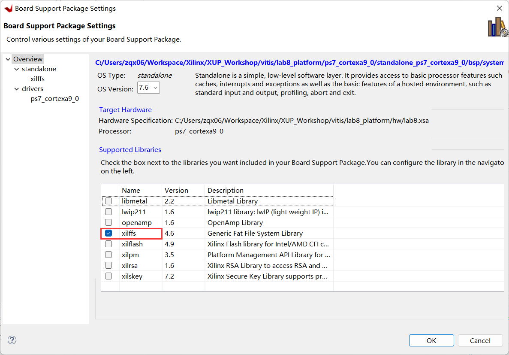
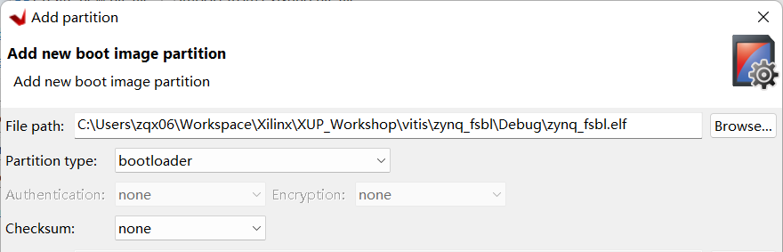
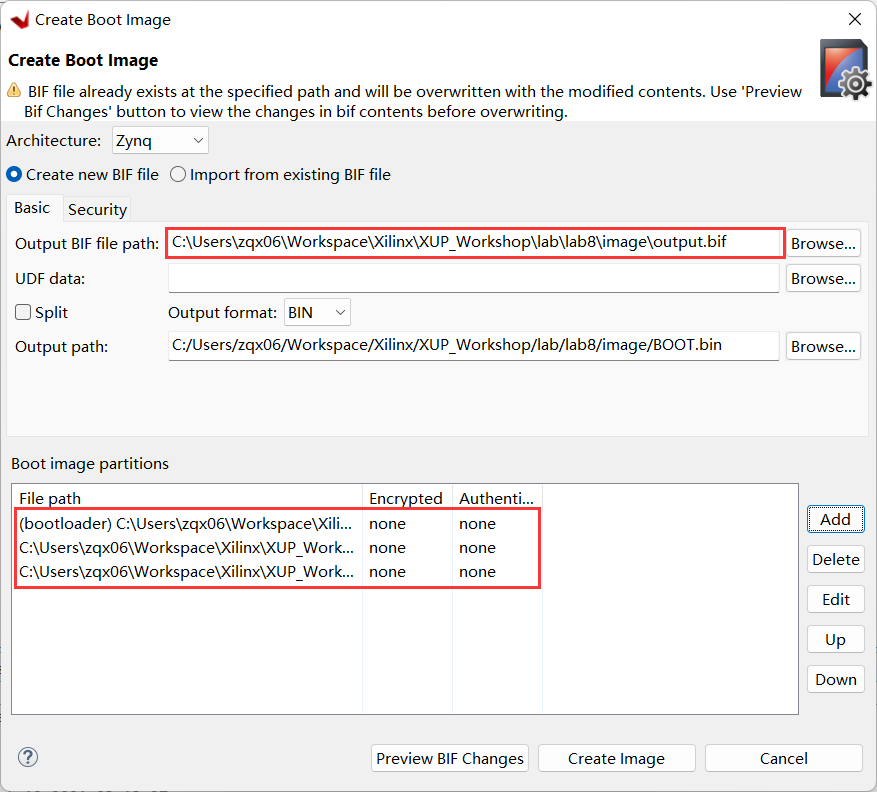
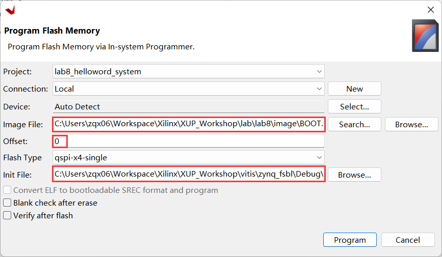
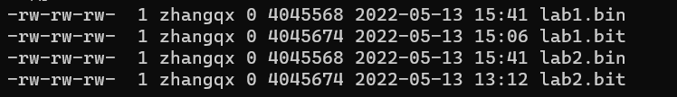
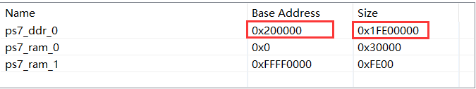
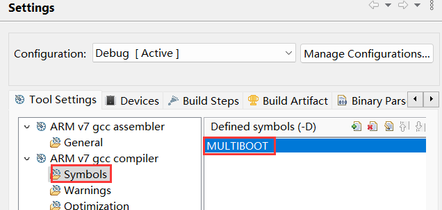

# Cấu hình và khởi động

## Mục tiêu

Sau khi hoàn thành bài thực hành này bạn sẽ có thể:

* Tạo mới một hệ thống có khả năng khởi động từ thẻ nhớ SD.
* Tạo mới một hệ thống có khả năng khởi động từ bộ nhớ QSPI Flash trên bo mạch.
* Nạp các bitstream được lưu trên thẻ SD hoặc trong bộ nhớ flash QSPI.
* Cấu hình phần PL sử dụng bitstream được lưu trữ thông qua tài nguyên PCAP.
* Thực thi các ứng dụng tương ứng.

## Các bước thực hiện
## Tạo dự án Vivado

1. Mở Vivado và chọn **Create New Project** và chọn **Next**.
2. Chọn nút Browse ở trường *Project Location* trong **New Project** form, duyệt đến **{labs}**, chọn **Select**.
3. Nhập **lab8** vào trường *Project Name*. Hãy đảm bảo rằng ô *Create Project Subdirectory* đã được chọn. Chọn **Next**.
4. Chọn tùy chọn **RTL Project** và bỏ chọn **Do not specify sources at this time**, chọn **Next**.
5. Chọn **Verilog** cho phần *Target language* ở phần *Add source*, ấn **Next**.
6. Chọn **Next** để bỏ qua phần thêm ràng buộc.
7. Tìm và chọn bo mạch **pynq-z2** dưới thẻ *board*, ấn **Next**.
8. Ấn **Finish** để tạo một dự án Vivado trống.

## Tạo hệ thống phần cứng dùng bộ tích hợp IP (IP Integrator)
### Tạo một khối thiết kế để tạo ra hệ thống phần cứng dựa trên bộ xử lý ARM Cortex-A9
1. Trong Flow Navigator, ấn chọn **Create Block Design** dưới phần IP Integrator
2. Đặt tên khối là **system** và ấn **OK**.
3. Ấn chọn nút **Add** hoặc **chuột phải vào cửa sổ Diagram > Add IP** và tìm **zynq** trong danh mục.
4. Nhấn đúp vào mục **ZYNQ7 Processing System** để thêm nó vào thiết kế.  
5. Chọn **Run Block Automation** ở phần thông báo đầu bảng điều khiển *Diagram*. Giữ tùy chọn mặc định *Apply Board Preset*, và ấn **OK**.
6. Nhấn đúp vào khối Zynq để mở cửa sổ tùy chỉnh. 

   >Sơ đồ khối của Zynq sẽ hiện ra, hiển thị các khối cấu hình khác nhau của Hệ thống xử lý.
   
### Cấu hình khối Ngoại vi I/O chỉ hỗ trợ QSPI, UART 0 và SD 0.
1. Chọn mục **MIO Configuration** ở phía bên trái cửa sổ.
2. Mở rộng phần **I/O Peripherals** và *bỏ chọn ENET 0, USB 0, và GPIO > GPIO MIO*, chỉ để lại *UART 0* và *SD 0* được chọn.
3. Ấn **OK**. Cửa sổ phần cấu hình sẽ đóng lại và sơ đồ khối sẽ được cập nhật.
4. Sử dụng wiring tool, kết nối FCLK_CLK0 với M_AXI_GP0_ACLK.
5. Chọn tab *Diagram*, ấn **Validate Design (F6)** để đảm bảo không có lỗi gì xảy ra.

## Xuất thiết kế sang Vitis IDE và tạo các dự án phần mềm
### Tạo HDL top-level của hệ thống nhúng và tạo bitstream
1. Trong Vivado, chọn tab *Sources*, mở rộng *Design Sources*, chuột phải vào *system.bd*, chọn **Create HDL Wrapper** và chọn **OK**.
2. Nhấp vào **Generate Bitstream** và ấn **Generate**. Ấn **Save** để lưu dự án, chọn **Yes** nếu được nhắc chạy các quy trình. Ấn **OK** để khởi chạy các quy trình.
3. Khi quá trình tạo các bitstream được hoàn tất thành công. Ấn **Cancel**.

### Xuất thiết kế sang Vitis IDE và tạo ứng dụng Hello World
1. Xuất cấu hình phần cứng bằng cách nhấp chọn **File > Export > Export Hardware….**
2. Nhấn chọn ô *Include Bitstream*, và chọn **OK**.
3. Khởi động Vitis IDE bằng cách chọn **Tools > Launch VITIS IDE** và chọn **OK**.
4. Trong Vitis IDE, chọn **File > New > Application Project**. 
5. Trong cửa sổ *Platform*, chọn tag **Create a new platform from hardware (XSA)**, chọn file **.xsa** đã xuất lúc trước. Đặt *Platform name* là **lab8_platform**. Ấn **Next**.
6. Trong cửa sổ *Application Project Details*, đặt **lab8helloworld là *Application project name***. Ấn **Next**.
7. Trong cửa số *Domain*, giữ các tùy chọn mặc định, chọn **Next**.
8. Trong cửa sổ *Templates*, chọn **Hello World** và ấn **Finish**.
9. Mở rộng **lab8platform trong Explorer, nhấn đúp vào platform.spr** để mở dự án platform.
10. Ở phía bên trái bảng điều khiển, nhấn chọn **Board Support Package**, và chọn **Modify BSP Settings...** ở bên phải.
11. Nhấp chọn ô **xilff** và ấn **OK**.
	<p align="center">
	
	</p>
	<p align="center">
	<i>Chọn xilffs trong BSP</i>
	</p>

12. Tạo platform project. (Chuột phải vào **lab8platform trong Explorer và chọn Build Project** hoặc nhấp vào nút có biểu tượng cái búa).
13. Tạo system project. (Chuột phải vào **lab8helloworld_system Explorer view và chọn Build Project** hoặc nhấp vào nút có biểu tượng cái búa).

### Tạo trình tải khởi động đầu tiên - FSBL (First Stage Boot Loader)
1. Chọn **File > New > Application Project**.
2. Trong cửa sổ *Platform*, chọn tag **Select a platform from repository** và chọn **lab8_platform**. Chọn **Next**.
3. Trong cửa sổ *Application Project Details*, đặt *Application project name* là **zynq_fsbl** . Ấn **Next**.
4. Tiếp tục ấn **Next**.
5. Trong cửa sổ *Templates*, chọn **Zynq FSBL** và ấn **Finish**.
6. Xây dựng dự án FSBL bằng cách chuột phải vào **zynq_fsbl_system** trong *Explorer* và chọn **Build Project**.

   > Một dự án zynq_fsbl sẽ được tạo ra và sẽ được sử dụng để tạo file BOOT.bin. File BOOT.bin sẽ được lưu trong SD card và sẽ được sử dụng để khởi động bo mạch.
   
## Tao Boot Image và Kiểm tra
### Tạo file BOOT.bin
1. Dùng System Explorer, tạo mới thư mục **image** trong thư mục **{labs}\lab8**.
2. Trong Vitis IDE, chọn **Xilinx > Create Boot Image > Zynq and Zynq Ultrascale**.
3. Chọn **Create new BIF file**.
4. Ấn nút Browse ở trường **Output BIF file path**, duyệt đến thư mục **{labs}\lab8\image** và chọn **Save** (giữ tên mặc định là output.bif).
5. Ấn nút **Add** ở phần *Boot image partitions*, ấn Browse ở trường *File path*, duyệt đến thư mục **{Vitis_Workspace}\zynq_fsbl\Debug** (nơi FSBL được tạo), chọn **zynq_fsbl.elf** và nhấp vào **Open**.
6. Đảm bảo loại phân vùng (partition type) là **bootloader** và ấn **OK**.

	<p align="center">
	
	</p>
	<p align="center">
	<i>Thêm các phân vùng FSBL</i>
	</p>

7. Nhấp vào nút **Add** ở phần *Boot image partitions* và thêm bitstream **system_wrapper.bit** từ thư mục **{Vitis_Workspace}\lab8_platform\hw** và nhấp **OK**.
8. Nhấp vào nút **Add** ở phần *Boot image partitions* và thêm software application **lab8_helloworld.elf** từ thư mục **{Vitis_Workspace}\lab8_helloworld\Debug** và chọn **OK**.
9. Chọn **Create Image**. 

    > File BOOT.bin sẽ được tạo ở thư mục **{labs}lab8\SD_image**. File này sẽ được sử dụng cho việc khởi động từ thẻ nhớ SD.

	<p align="center">
	
	</p>
	<p align="center">
	<i>Tạo file ảnh BOOT.bin</i>
	</p>

10. Chèn một thẻ nhớ MicroSD trống (định dạng **FAT32**) vào một thiết bị đọc thẻ, và sao chép tệp BOOT.bin từ thư mục hình ảnh vào thẻ nhớ MicroSD.

### Kiểm tra chức năng bằng cách khởi động từ thẻ SD
1. Đặt thẻ MicroSD vào bo mạch. 
2. Đặt bo mạch sang chế độ khởi động từ thẻ SD, bật nguồn.
3. Kết nối PC với cổng UART bằng cáp micro-USB và sử dụng Vitis Serial Terminal hoặc các Terminal khác với cổng COM hiện tại và tốc độ baud là 115200.
4. Bạn sẽ thấy thông điệp **Hello World** xuất hiện trên cửa sổ terminal. Nếu không thấy, nhấn nút **RST/SRST** trên bo mạch.
5. Khi đã hài lòng, tắt nguồn và lấy thẻ SD ra.
  
### Kiểm tra chức năng bằng cách khởi động từ bộ nhớ flash QSPI
1. Đặt bo mạch sang chế độ JTAG, bật nguồn.
2. Chọn **Xilinx > Program Flash.**
3. Ấn nút **Browse** ở trường Image File, duyệt đến thư mục **{labs}\lab8\image**, chọn file **BOOT.bin** và ấn **Open**.
4. Ấn nút **Browse** ở trường Init File, duyệt đến thư mục **{Vitis_Workspace}\zynq_fsbl\Debug**, chọn file **zynq_fsbl.elf** và chọn **Open**.
5. Cài đặt offset là 0 ở trường *Offset* và nhấp vào nút **Program**.

	<p align="center">
	
	</p>
	<p align="center">
	<i>Định dạng Program Flash Memory</i>
	</p>

6. Tắt nguồn bo mạch, chuyển bo mạch sang chế độ QSPI và bật nguồn.
7. Ngắt kết nối và kết nối lại cửa sổ Terminal.
8. Nhấn **RST\SRST** để thấy thông điệp **Hello World** ở cửa sổ Terminal.
9. Khi đã hài lòng, tắt nguồn bo mạch.

## Chuẩn bị cho việc khởi động đa ứng dụng từ thẻ SD
  >Các file thực thi lab1 và lab2 cần ở định dạng .bin trước khi sao chép vào thẻ SD. Khu vực bộ nhớ được cấp phát cho mỗi ứng dụng cần được chỉnh sửa để chúng không chồng chéo lên nhau hoặc chồng chéo với ứng dụng chính. Có thể sử dụng các file bin (**lab1elf.bin** và **lab2elf.bin**) được cung cấp trong thư mục **{sources}\lab8\SD_image** để sao chép vào thẻ SD. Làm theo các bước trong **Phụ lục A-1** và **Phụ lục A-2** nếu bạn muốn tự tạo các file đó. 

### Tạo ứng dụng lab8_sd
1. Chọn **File > New > Application Project.**
2. Ở cửa sổ **Platform**, nhấp vào tag **Select a platform from repository** và chọn **lab8_platform**.
3. Đặt tên dự án là **lab8_sd**, ấn **Next**.
4. Chọn miền **standalone_ps7_cortexa9_0**. Ấn **Next**.
5. Chọn **Empty Application (C)** ở cửa sổ *Templates* và ấn **Finish**.
6. Mở **lab8_sd_system > lab8_sd**, chuột phải vào thư mục **src** và chọn **Import Sources…**
7. Duyệt để chọn thư mục **{sources}\lab8**, nhấp Open Folder.
8. Chọn các file **lab8_sd.c, devcfg.c, devcfg,h, load_elf.s**, ấn **Finish** để thêm các file này vào dự án.
9. Thay đổi (nếu cần) các giá trị **LAB1_ELFBINFILE_LEN, LAB1_ELFBINFILE_LEN, LAB2_ELF_EXEC_ADDR, LAB2_ELF_EXEC_ADDR** và lưu tệp. 
10. Xây dựng dự án (Build project).

## Tạo ảnh thẻ SD và kiểm tra
### Tạo các file bin từ lab1 và lab2
1. Dùng System Explorer, tạo thư mục có tên là **SD_image** dưới thư mục **{labs}\lab8**.
2. Trong System Explorer, sao chép tệp **system_wrapper.bit** của dự án lab1 vào thư mục **SD_image** và đổi tên thành **lab1.bit**, làm tương tự cho lab2.
   
   **{labs}/lab1/lab1.runs/impl_1/system_wrapper.bit -> SD_image/lab1.bit** 

   **{labs}/lab2/lab2.runs/impl_1/system_wrapper.bit -> SD_image/lab2.bit**
   
   >Lệnh bootgen của Vitis Shell sẽ được sử dụng để chuyển đổi các tệp bit thành định dạng nhị phân được yêu cầu. Bootgen yêu cầu một tệp .bif đã được cung cấp trong thư mục sources/lab8. Tệp .bif chỉ định các tệp .bit mục tiêu.
   
3. Mở cửa sổ dòng lệnh bằng cách chọn **Xilinx > Vitis Shell**.
4. Trong cửa sổ dòng lệnh, chuyển đến thư mục bitstreams bằng lệnh cd.
    ```bash 
    cd {labs}/lab8/SD_image
    ```
5. Tạo các tệp bitstream từng phần ở định dạng BIN sử dụng các tệp “.bif” nằm trong thư mục *{sources}*. Sử dụng các câu lệnh sau:
    ```bash
    bootgen -image {sources}/lab8/lab1_bit_files.bif -w -process\_bitstream bin
    ```
    ```bash
    bootgen -image {sources}/lab8/lab2_bit_files.bif -w -process\_bitstream bin
    ```
6. Đổi tên các tệp **lab1.bit.bin** và **lab2.bit.bin** thành **lab1.bin** và **lab2.bin**.
7. Kích thước của tệp cần phải khớp với kích thước được chỉ định trong tệp **lab8_sd.c**. Kích thước này có thể xác định bằng cách kiểm tra phần các thuộc tính của tệp. Nếu kích thước không khớp, thay đổi mã nguồn và lưu lại (Các giá trị được định nghĩa là **LAB1_BITFILE_LEN** và **LAB2_BITFILE_LEN**).

   <p align="center">
   
   </p>
   <p align="center">
   <i>Kiểm tra kích thước của tệp bin được tạo</i>
   </p>
   
   >Lưu ý rằng các tệp lab1.bin và lab2.bin phải có cùng kích thước.

### Tạo tệp BOOT.bin
1. Trong SDK,  chọn **Xilinx > Create Boot Image > Zynq and Zynq Ultrascale**.
2. Chọn **Create new BIF file**.
3. Đối với *Output BIF file path*, chọn Browse và duyệt đến thư mục **{labs}\lab8\SD_image** và ấn **Save**.
4. Nhấp vào nút **Add** ở trường *boot image partitions* và duyệt đến **{Vitis_Workspace}/lab8_platform/zynq_fsbl**, chọn **fsbl.elf**, nhấp **Open** và nhấp **OK**.
5. Nhấp vào nút **Add** ở trường *boot image partitions* và duyệt đến **{Vitis_Workspace}/lab8_platform/hw**, chọn **system_wrapper.bit**, nhấp **Open** và nhấp **OK**.
6. Nhấp vào nút **Add** ở trường *boot image partitions* và duyệt đến **{Vitis_Workspace}/lab8_sd/Debug**, chọn **lab8_sd.elf**, nhấp **Open** và nhấp **OK**. 
7. Nhấp vào nút **Create Image**.

    >Tệp BOOT.bin sẽ được tạo trong thư mục **{labs}lab8\SD_image**.

### Kiểm tra chức năng thiết kế bằng cách khởi động từ thẻ SD
1. Trong Windows explorer, sao chép các tệp **lab1elf.bin** và **lab2elf.bin** từ thư mục **{sources}\lab8\SD_image** hoặc từ các thư mục cá nhân (nếu bạn đã thực hiện các phần tùy chọn trong bước trước) và đặt chúng vào thư mục **{labs}\lab8\SD_image**.
   
   **{Vitis_Workspace}\lab1\Debug\lab1elf.bin -> SD_image**

   **{Vitis_Workspace}\lab2\Debug\lab2elf.bin -> SD_image**
   
2. Chèn một thẻ MicroSD trống (được định dạng **FAT32**) vào một đầu đọc thẻ SD, và sử dụng System Explorer, sao chép hai tệp “.bin”, hai tệp “elf.bin” và BOOT.bin từ thư mục **SD_image** vào thẻ SD.
3. Đặt thẻ SD vào bo mạch, và cài đặt các chân để khởi động bo mạch từ thẻ SD. Kết nối PC của bạn với cổng UART bằng cáp micro-USB được cung cấp.
4. Bật nguồn cho bo mạch.
5. Khởi động terminal và làm theo menu. Nhấn nút **RST/SRST** nếu bạn không thấy menu. 
6. Khi hoàn thành việc kiểm tra một ứng dụng, tắt nguồn bo mạch và kiểm tra chức năng của ứng dụng thứ hai hoặc nhấn nút **RST/SRST** trên bo mạch để hiển thị menu lần nữa. 
7. Khi hoàn tất, tắt nguồn bo mạch.

## Tạo ứng dụng và hình ảnh QSPI
>Các tệp bin đã được chuẩn bị trong thư mục: **{sources}\lab5\QSPI_image** có thể được sử dụng để tạo các file MCS. Xem các bước để tạo các tệp BIN như vậy ở **Phụ lục B-1** và **Phụ lục B-2**.

### Tạo ứng dụng lab8_qspi
1. Chọn **File > New > Application Project**.
2. Trong cửa sổ *Plarform*, nhấp vào thẻ **Select a platform from repository** và chọn **lab8_platform**.
3. Nhập **lab8_qspi** làm tên dự án, chọn **Next**.
4. Chọn miền là **standalone_ps7_cortexa9_0**. Chọn **Next**.
5. Chọn **Empty Application (C)** trong cửa sổ *Templates* và ấn **Finish**.
6. Mở **lab8_qspi_system > lab8_qspi** và chuột phải vào thư mục **src** và chọn **Import Sources…**
7. Duyệt để chọn thư mục **{sources}\lab8**, ấn Open Folder.
8. Chọn **lab8_qspi.c**, chọn **Finish** để thêm nó vào dự án.
9. Xây dựng dự án.
    
### Tạo tệp lab8.mcs
1. Sử dụng System Explorer, tạo thư mục **QSPI_image** dưới thư mục **lab8**.
2. Chọn **Xilinx > Create Boot Image > Zynq and Zynq Ultrascale**.
3. Chọn **Create new BIF file**, nhấp vào nút *Browse* của trường *Output BIF file path* và duyệt đến thư mục **{labs}\lab8\QSPI_image**, để tên mặc định là *output.bif* và chọn **Save**.
4. Nhấp vào nút **Add** của trường *boot image partitions* và thêm file fsbl, **fsbl.elf**, từ **{Vitis_Workspace}/lab8_platform\zynq_fsbl** và nhấp **OK**.
5. Nhấp vào nút **Add** của trường *boot image partitions* và thêm file bitstream, **system_wrapper.bit**, từ **{Vitis_Workspace}/lab8_platform\hw** và nhấp **OK**.
6. Nhấp vào nút **Add** của trường *boot image partitions* và thêm file **lab8_qspi.elf**, từ **{Vitis_Workspace}/lab8_qspi\Debug** và nhấp **OK**.
7. Nhấp vào nút **Add** của trường *Boot image partition* một lần nữa và thêm **lab1.bin** từ hình ảnh khởi động đã tạo của dự án lab1 (trong **{labs}\lab1**) hoặc từ thư mục **{sources}\lab8\QSPI_image** được cung cấp. Nhập **0x400000** vào trường *Offset* và nhấp **OK**.
8. Tương tự, thêm **lab2.bin** từ hình ảnh khởi động đã tạo của dự án lab2 (trong **{labs}\lab2**) hoặc từ thư mục **{sources}\lab8\QSPI_image** được cung cấp. Nhập **0x800000** vào trường *Offset* và nhấp **OK**.
9.  Thay đổi tên tệp đầu ra thành **lab8.mcs** và vị trí tệp thành **lab8\QSPI_image**.
10. Nhấp vào nút **Create Image**. Tệp lab8.mcs sẽ được tạo trong thư mục **lab8\QSPI_image**.

### Lập trình QSPI bằng tiện ích Flash Writer
1. Đặt bo mạch ở chế độ JTAG. Bật nguồn cho bo mạch.
2. Chọn **Xilinx > Program Flash**.
3. Nhấp vào nút **Browse** của trường *Image File*, và duyệt đến thư mục **{labs}\lab8\QSPI_image**, chọn tệp **lab8.mcs**, và nhấp **Open**.
      >Sử dụng tệp mcs được cung cấp trong thư mục **{sources}\lab8\QSPI_image** nếu bạn đã bỏ qua bước tạo hình ảnh QSPI trước đó.
4. Trong trường *Offset*, nhập offset là **0** và nhấp vào nút **Program**. Bộ nhớ flash QSPI sẽ được lập trình. Quá trình này có thể mất đến 4 phút.

### Kiểm tra khả năng khởi động đa ứng dụng từ QSPI
1. Tắt nguồn bo mạch, đổi nó sang chế độ QSPI và bật nguồn cho bo mạch.
2. Bắt đầu phiên giả lập terminal và nhấn nút **RST/SRST** để xem menu.
3. Theo dõi menu và kiểm tra chức năng của mỗi lab.
    
    >Nhấn 1 để tải và thực thi lab1 hoặc nhấn 2 để tải và thực thi lab2. Quay lại menu bằng cách tắt và bật lại bo mạch.
4. Khi đã hài lòng, tắt nguồn cho bo mạch.
5. Đóng Vitis IDE và Vivado 
  
## Kết luận

Bài thực hành này đã hướng dẫn bạn tạo các hình ảnh khởi động có khả năng khởi động các ứng dụng độc lập từ thẻ SD hoặc bộ nhớ flash QSPI. Sau đó, bạn đã tạo thiết kế có khả năng khởi động nhiều ứng dụng và các cấu hình mà bạn đã phát triển trong các bài thực hành trước đó.

## Phụ lục A-1

### Sử dụng lệnh objcopy để chuyển đổi tệp elf của lab1 thành tệp nhị phân

1. Khởi động Vitis IDE và duyệt đến workspace trỏ đến **lab1_system** và nhấp **OK**.
2. Chuột phải vào **lab1system > lab1, chọn *Generate Linker Script*, thay đổi các phần *code, data, heap, và stack* để sử dụng *ps7_ddr_0*, và nhấp Generate**.  Ấn **Yes** để ghi đè lên linker script.
3. Mở rộng **lab1_system > lab1 > src** trong Explorer, và nhấn đúp vào **lscript.ld** để mở nó.
4. Trong chế độ xem chỉnh sửa lscript, thay đổi Base Address của *ps7_ddr_0_AXI_BASEADDR* từ **0x00100000** thành **0x00200000** và thay đổi Size từ **0x1FF00000** thành **0x1FE00000**.

	<p align="center">
	
	</p>
	<p align="center">
	<i>Thay đổi Base address và Size</i>
	</p>

5. Nhấn **Ctrl-S** để lưu thay đổi.
6. Xây dựng dự án hệ thống (Build project).
7. Chọn **Xilinx > Vitis Shell** để mở phiên shell.
8. . Trong cửa sổ shell, chuyển đến thư mục **{Vitis_Workspace}\lab1\Debug** bằng lệnh **cd**.
9. Chuyển đổi tệp lab1.elf thành tệp lab1elf.bin bằng cách gõ lệnh sau.

    ```bash
    arm-none-eabi-objcopy -O binary lab1.elf lab1elf.bin 
    ``` 
	
10. Gõ `ls –l` trong cửa sổ shell và ghi chú kích thước của tệp. Trong trường hợp này, nó là **32776**, tương đương với **0x8008** byte.
11. Xác định điểm nhập “main()” của chương trình bằng cách sử dụng lệnh sau trong cửa sổ shell.

    ```bash
    arm-none-eabi-objdump -S lab1.elf | grep “<main>”
    ```
    Nó nên ở trong **0x0020074C**.
    
    >Ghi chú hai con số (độ dài và điểm nhập) vì chúng sẽ được sử dụng trong ứng dụng lab8_sd.

12. Đóng cửa sổ Shell.

## Phụ lục A-2
### Sử dụng lệnh objcopy để chuyển đổi tệp elf của lab2 thành tệp nhị phân

1. Khởi động Vitis IDE và duyệt đến workspace trỏ đến **lab2_system** và nhấp **OK**.
2. Chuột phải vào **lab2system > lab2, chọn *Generate Linker Script*, thay đổi các phần *code, data, heap, và stack* để sử dụng *ps7_ddr_0*, và nhấp Generate**.  Ấn **Yes** để ghi đè lên linker script.
3. Mở rộng **lab2_system > lab2 > src** trong Explorer, và nhấp đúp vào **lscript.ld** để mở nó.
4. Trong chế độ xem chỉnh sửa lscript, thay đổi Base Address của *ps7_ddr_0_AXI_BASEADDR* từ **0x00100000** thành **0x00600000** và thay đổi Size từ **0x1FF00000** thành **0x1FA00000**.

	<p align="center">
	
	</p>
	<p align="center">
	<i>Thay đổi Base address và Size</i>
	</p>

1. Nhấn **Ctrl-S** để lưu thay đổi.
2. Xây dựng dự án hệ thống (Build project).
3. Chọn **Xilinx > Vitis Shell** để mở phiên shell.
4. Trong cửa sổ shell, chuyển đến thư mục **{Vitis_Workspace}\lab1\Debug** bằng lệnh cd.
5. Chuyển đổi tệp lab2.elf thành tệp lab2elf.bin bằng cách gõ lệnh sau.
    ```bash
    arm-none-eabi-objcopy -O binary lab2.elf lab2elf.bin 
    ``` 
	
6.  Gõ `ls –l` trong cửa sổ shell và ghi chú kích thước của tệp. Trong trường hợp này, nó là **32776**, tương đương với **0x8008** byte.
7.  Xác định điểm nhập “main()” của chương trình bằng cách sử dụng lệnh sau trong cửa sổ shell.
    ```bash
    arm-none-eabi-objdump -S lab2.elf | grep “<main>”
    ```
    Nó nên ở trong **0x00600584**.
    
    >Ghi chú hai con số (độ dài và điểm nhập) vì chúng sẽ được sử dụng trong ứng dụng lab8_sd.

8.  Đóng cửa sổ Shell.

## Phụ lục B-1
>Bước này nhằm đưa mã liên quan đến thanh ghi MULTIBOOT vào Lab1. Sau đó chuyển đổi tệp thực thi lab1 thành định dạng (.bin) được yêu cầu.

1. Khởi động Vitis IDE và duyệt đến workspace trỏ đến **lab1** và nhấp **OK**.
2. Chuột phải vào mục **lab1**, chọn tùy chọn *C/C++ Build Settings*.
3. Chọn *Symbols* trong khung bên trái dưới nhóm *ARM gcc compiler*, nhấp vào nút + ở bên phải, nhập **MULTIBOOT** vào form, nhấp **OK** và **OK**.

	<p align="center">
	
	</p>
	<p align="center">
	<i>Thiết lập symbols do người dùng định nghĩa</i>
    </p>

4. Xây dựng lại dự án hệ thống (Build project).
5. Chọn **Xilinx > Create Boot Image > Zynq and Zynq Ultrascale**.
6. Chọn tùy chọn **Create new BIF file**, nhấp vào nút *Browse* của trường *Output BIF file path* và duyệt đến thư mục **{labs}\lab1**, đặt tên tệp là **lab1**, và nhấp **Save**.
7. Thêm ba tệp dưới đây vào trường *Boot image partitions*
   1. {Vitis_Workspace}\lab8_platform\zynq_fsbl\fsbl.elf 
   2. {Vitis_Workspace}\lab1_platform\hw\system_wrapper.bit 
   3. {Vitis_Workspace}\lab1\Debug\lab1.elf
8. Thay đổi tên tệp đầu ra thành **lab1.bin**, đảm bảo rằng thư mục đầu ra là **{labs}\lab1**.
9. Nhấp vào nút **Create Image**. Tệp lab1.bin sẽ được tạo trong thư mục lab1.
    
## Phụ lục B-2
>Bước này nhằm đưa mã liên quan đến thanh ghi MULTIBOOT vào Lab2. Sau đó chuyển đổi tệp thực thi lab2 thành định dạng (.bin) được yêu cầu.

1. Khởi động Vitis IDE và duyệt đến workspace trỏ đến **lab2** và nhấp **OK**.
2. Chuột phải vào mục **lab2**, chọn tùy chọn *C/C++ Build Settings*.
3. Chọn *Symbols* trong khung bên trái dưới nhóm *ARM gcc compiler*, nhấp vào nút + ở bên phải, nhập **MULTIBOOT** vào form, nhấp **OK** và **OK**.
4. Xây dựng lại dự án hệ thống (Build project).
5. Chọn **Xilinx > Create Boot Image > Zynq and Zynq Ultrascale**.
6. Chọn tùy chọn **Create new BIF file**, nhấp vào nút *Browse* của trường *Output BIF file path* và duyệt đến thư mục **{labs}\lab2**, đặt tên tệp là **lab2**, và nhấp **Save**.
7. Thêm ba tệp dưới đây vào trường *Boot image partitions*
   1. {Vitis_Workspace}\lab8_platform\zynq_fsbl\fsbl.elf 
   2. {Vitis_Workspace}\lab2_platform\hw\system_wrapper.bit 
   3. {Vitis_Workspace}\lab2\Debug\lab2.elf
8. Thay đổi tên tệp đầu ra thành **lab2.bin**, đảm bảo rằng thư mục đầu ra là **{labs}\lab2**.
9. Nhấp vào nút **Create Image**. Tệp lab2.bin sẽ được tạo trong thư mục lab2.
